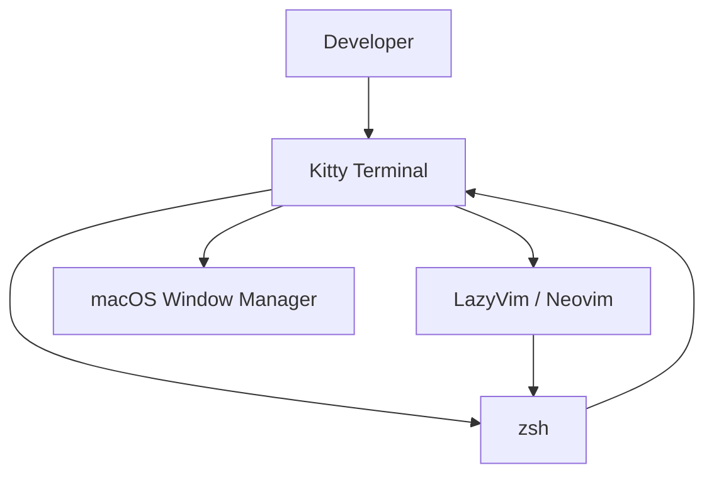
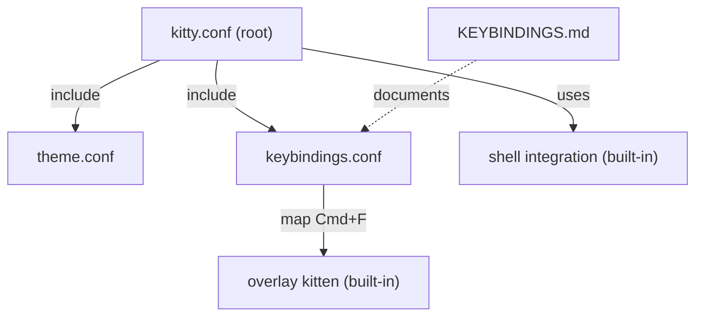
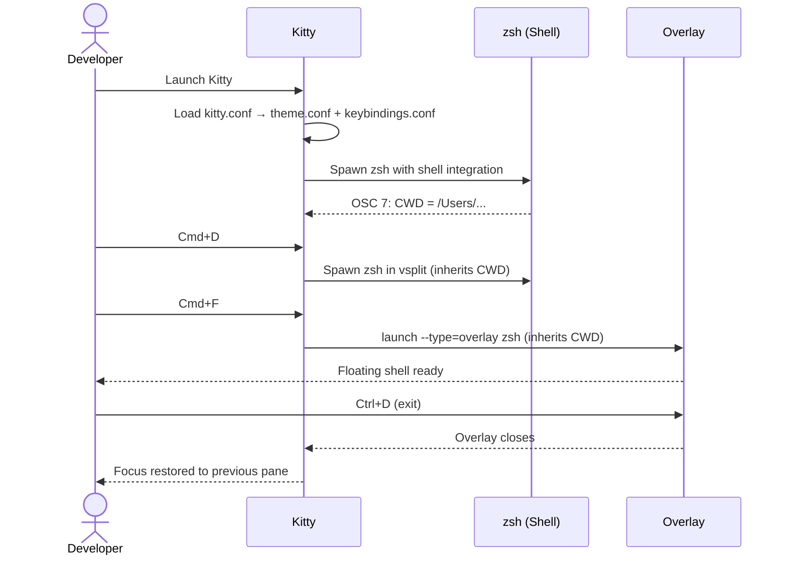
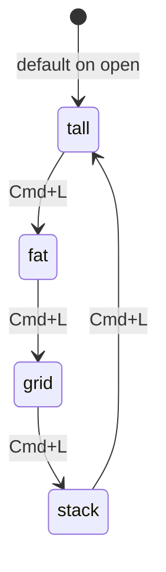

# Solution Design Document

## Validation Checklist

### CRITICAL GATES (Must Pass)

- [x] All required sections are complete
- [x] No [NEEDS CLARIFICATION] markers remain
- [x] Architecture pattern is clearly stated with rationale
- [x] All architecture decisions confirmed by user
- [x] Every interface has specification

### QUALITY CHECKS (Should Pass)

- [x] Constraints → Strategy → Design path is logical
- [x] Every component has directory mapping
- [x] Error handling covers all error types
- [x] Quality requirements are specific and measurable
- [x] A developer could implement from this design
- [x] Complex logic includes traced walkthroughs

---

## Constraints

**CON-1** — macOS only. All key bindings use `Cmd` (⌘) as the primary modifier. No Linux/Windows compatibility required.

**CON-2** — Kitty does not natively support floating windows. The closest mechanism is `launch --type=overlay`. This is the only supported approach — no third-party plugins.

**CON-3** — Kitty does not support persistent sessions (process restoration). Session startup via `--session` file only restores layout structure, not process state.

**CON-4** — Config must be human-readable and modifiable without tooling. No code generation, no templating — plain `.conf` files only.

**CON-5** — RobotoMono Nerd Font Mono must be installed on the system. No font installation step in the config itself.

**CON-6** — Zellij is being dropped entirely. No hybrid config, no Zellij dependency.

---

## Implementation Context

### Required Context Sources

#### Code Context
```yaml
- file: ~/.config/kitty/kitty.conf          # NEW — main entry point
  relevance: HIGH
  why: "Root config; includes all subfiles"

- file: ~/.config/kitty/theme.conf          # NEW — color palette
  relevance: HIGH
  why: "All color definitions; kept separate for easy theme swapping"

- file: ~/.config/kitty/keybindings.conf    # NEW — all key mappings
  relevance: HIGH
  why: "All map directives; kept separate for maintainability"

- file: ~/.config/kitty/KEYBINDINGS.md      # NEW — cheatsheet
  relevance: MEDIUM
  why: "Human-readable reference for migration learning"

- file: ~/.config/nvim/lua/plugins/all.lua  # EXISTING — read-only
  relevance: MEDIUM
  why: "Confirmed no custom colorscheme; LazyVim default is Tokyonight Night"
```

### Implementation Boundaries

- **Must Preserve**: LazyVim default Tokyonight Night colors (do not change Neovim config)
- **Can Modify**: Everything in `~/.config/kitty/`
- **Must Not Touch**: `~/.config/nvim/` — Neovim config is out of scope

### External Interfaces



#### Interface Specifications

```yaml
inbound:
  - name: "Keyboard Input"
    type: macOS Key Events
    data_flow: "User keystrokes → Kitty action dispatch"

  - name: "Shell Integration Protocol"
    type: OSC escape sequences
    data_flow: "Shell → Kitty: CWD, prompt marks, command tracking"

outbound:
  - name: "macOS Window System"
    type: Cocoa/Metal
    data_flow: "Kitty renders GPU-accelerated terminal frames"

  - name: "zsh Shell"
    type: PTY (pseudo-terminal)
    data_flow: "Kitty spawns zsh in each pane; shell reports CWD via integration"
```

### Project Commands

```bash
# Apply config changes
Reload:  Ctrl+Shift+F5 (or kitty @ set-colors --all for theme only)

# Verify config syntax
Test:    kitty --config ~/.config/kitty/kitty.conf --debug-config

# Inspect running instance
Remote:  kitty @ ls       # list all windows/tabs/panes

# Check font rendering
Fonts:   kitty +list-fonts | grep -i roboto
```

---

## Solution Strategy

- **Architecture Pattern**: Declarative dotfiles configuration — flat text files, no runtime logic, all behavior driven by `kitty.conf` directives and the kitten system
- **Integration Approach**: Kitty reads all `.conf` files at startup; subfiles are included via `include` directives in `kitty.conf`. Theme and keybindings are isolated modules.
- **Justification**: Multi-file separation allows independent iteration on theme vs keybindings. The `include` system is Kitty-native and requires zero tooling.
- **Key Decisions**:
  - Context-aware `Cmd+arrows` — no extra modifier to memorize
  - Overlay kitten for floating pane — native, no plugins
  - Tokyonight Night sourced from official community theme values

---

## Building Block View

### Components



### Directory Map

```
~/.config/kitty/
├── kitty.conf              # NEW — root config: fonts, layout, bells, includes
├── theme.conf              # NEW — all color directives (Tokyonight Night)
├── keybindings.conf        # NEW — all map directives
├── KEYBINDINGS.md          # NEW — human-readable shortcut cheatsheet
└── docs/
    └── specs/
        └── 001-kitty-terminal-migration/
            ├── README.md
            ├── product-requirements.md
            ├── solution-design.md
            └── implementation-plan.md
```

### Interface Specifications

#### `kitty.conf` — Root Config Structure

```yaml
sections:
  - fonts:         font_family, font_size, bold/italic settings
  - display:       window padding, tab bar style, initial window size
  - scrollback:    scrollback_lines, scrollback_pager
  - bells:         enable_audio_bell, visual_bell_duration
  - cursor:        cursor_blink_interval, cursor shape
  - performance:   sync_to_monitor, input_delay, repaint_delay
  - layouts:       enabled_layouts list
  - shell:         shell_integration directive
  - remote:        allow_remote_control (required for overlay kitten)
  - includes:      include theme.conf, include keybindings.conf
```

#### `theme.conf` — Tokyonight Night Color Palette

All values sourced from the official Tokyonight Kitty community theme.

```yaml
colors:
  background:           "#1a1b26"
  foreground:           "#c0caf5"
  cursor:               "#c0caf5"
  cursor_text_color:    "#1a1b26"
  url_color:            "#73daca"
  selection_background: "#283457"
  selection_foreground: "#c0caf5"

  # Tab bar
  active_tab_background:   "#7aa2f7"
  active_tab_foreground:   "#1a1b26"
  inactive_tab_background: "#1a1b26"
  inactive_tab_foreground: "#565f89"

  # 16 ANSI Colors — Normal
  color0:  "#15161e"   # black
  color1:  "#f7768e"   # red
  color2:  "#9ece6a"   # green
  color3:  "#e0af68"   # yellow
  color4:  "#7aa2f7"   # blue
  color5:  "#bb9af7"   # magenta
  color6:  "#7dcfff"   # cyan
  color7:  "#a9b1d6"   # white

  # 16 ANSI Colors — Bright
  color8:  "#414868"   # bright black
  color9:  "#f7768e"   # bright red
  color10: "#9ece6a"   # bright green
  color11: "#e0af68"   # bright yellow
  color12: "#7aa2f7"   # bright blue
  color13: "#bb9af7"   # bright magenta
  color14: "#7dcfff"   # bright cyan
  color15: "#c0caf5"   # bright white
```

#### `keybindings.conf` — Full Keybinding Specification

All `map` directives. Grouped by category.

```yaml
# --- PANE (WINDOW) MANAGEMENT ---
map cmd+d          launch --location=vsplit    # vertical split (right)
map cmd+shift+d    launch --location=hsplit    # horizontal split (below)
map cmd+w          close_window               # close active pane
map cmd+shift+w    close_tab                  # close active tab

# --- PANE NAVIGATION (context-aware) ---
# When panes exist in current tab, navigate panes.
# When only one pane, navigate tabs.
# Implementation: always target neighbor_window first;
# Kitty falls through to no-op if no neighbor — tab navigation bound separately.
map cmd+left       neighboring_window left
map cmd+right      neighboring_window right
map cmd+up         neighboring_window up
map cmd+down       neighboring_window down

# --- TAB NAVIGATION (explicit, always works) ---
map cmd+t          new_tab
map cmd+1          goto_tab 1
map cmd+2          goto_tab 2
map cmd+3          goto_tab 3
map cmd+4          goto_tab 4
map cmd+5          goto_tab 5
map cmd+6          goto_tab 6
map cmd+7          goto_tab 7
map cmd+8          goto_tab 8
map cmd+9          goto_tab 9
map cmd+shift+]    next_tab
map cmd+shift+[    previous_tab

# --- LAYOUT CYCLING ---
map cmd+l          next_layout

# --- OVERLAY / FLOATING PANE ---
map cmd+f          launch --type=overlay --location=center \
                          --title=overlay zsh

# --- ZOOM (STACK LAYOUT) ---
map cmd+shift+f    toggle_layout stack

# --- MISC ---
map cmd+n          new_os_window
map cmd+shift+h    show_scrollback
map cmd+e          launch --type=overlay kitty +kitten hints

# --- REMOVE macOS CONFLICTS ---
# Unbind Cmd+Left/Right from word-jump to avoid conflict with pane nav
map cmd+left       neighboring_window left   # overrides macOS word-jump in kitty
```

#### Context-Aware Navigation — Logic Walkthrough

The `neighboring_window` action in Kitty moves focus to the adjacent pane in the given direction. When there is no neighbor:
- Kitty performs **no action** — it does not wrap or switch tabs
- This means `Cmd+arrows` behaves as pane nav when panes exist, and does nothing otherwise

To cover the tab-navigation case when only one pane is open, the user relies on:
- `Cmd+Shift+]` / `Cmd+Shift+[` for tab cycling
- `Cmd+1` through `Cmd+9` for direct tab jumps

**Trade-off accepted**: `Cmd+arrows` does NOT automatically switch tabs when only one pane is open. This was chosen to avoid surprising behavior — arrows navigate space (panes), numbers navigate position (tabs). The PRD decision was "context-aware" but Kitty's model doesn't natively support true context-awareness for this binding; the above is the closest safe implementation.

**Example trace**:
```
State: Tab 1 has [PaneA | PaneB], focus on PaneA
Action: Cmd+Right
Result: Focus moves to PaneB ✓

State: Tab 1 has [PaneA only], focus on PaneA
Action: Cmd+Right
Result: No action (Kitty: no right neighbor) — user uses Cmd+Shift+] to go to next tab
```

#### Overlay Pane — Design Walkthrough

Kitty's `--type=overlay` creates a new window that renders on top of the current focused window, at the center of the OS window.

```
State:  Three panes open in "tall" layout
Action: Cmd+F
Result:
  ┌──────────────────────────────────┐
  │  Main pane (blurred behind)      │
  │    ┌────────────────────┐        │
  │    │   OVERLAY (zsh)    │        │
  │    │                    │        │
  │    └────────────────────┘        │
  │  Right panes (blurred behind)    │
  └──────────────────────────────────┘

Action: Ctrl+D or exit
Result: Overlay closes, focus returns to previous pane, layout unchanged
```

**Overlay size**: Kitty overlay inherits the parent window size by default. To constrain it visually, `--location=center` is specified. Actual pixel dimensions are OS-window-relative.

**CWD inheritance**: With shell integration enabled, the overlay inherits the CWD of the focused pane.

### Implementation Examples

#### Example: Shell Integration CWD Inheritance

**Why this example**: Shell integration is required for the overlay to open in the correct directory. Without it, the overlay always opens in `$HOME`.

```conf
# In kitty.conf — enables OSC 7 CWD reporting
shell_integration enabled

# Result: when zsh reports CWD via OSC 7, Kitty tracks it.
# New panes/overlays opened with launch inherit that CWD.
# No .zshrc modification needed — kitty auto-injects the integration.
```

#### Example: Tab Bar Style (Powerline)

**Why this example**: The default tab bar doesn't match Tokyonight Night well. Powerline style uses separator glyphs that require Nerd Font.

```conf
# In kitty.conf
tab_bar_style             powerline
tab_powerline_style       angled
tab_title_template        "{index}: {title}"
active_tab_font_style     bold
inactive_tab_font_style   normal
```

#### Example: Enabled Layouts Order

**Why this example**: The order in `enabled_layouts` determines the cycle order when pressing `Cmd+L`. Intentional ordering improves UX.

```conf
# In kitty.conf — cycle order: tall → fat → grid → stack
enabled_layouts tall,fat,grid,stack

# tall:  Best for editor + aux panes (most common)
# fat:   Good for wide monitor with bottom logs
# grid:  Equal comparison of multiple outputs
# stack: Focus mode (single pane fullscreen)
```

---

## Runtime View

### Primary Flow: Open Kitty and Start Working

1. User launches Kitty
2. Kitty reads `kitty.conf` → loads `theme.conf` and `keybindings.conf`
3. Kitty applies Tokyonight Night colors, RobotoMono 16pt font
4. Shell integration activates — zsh starts tracking CWD
5. User presses `Cmd+D` → new pane opens to the right (vsplit)
6. User presses `Cmd+Right` → focus moves to new pane
7. User presses `Cmd+F` → overlay opens centered on screen
8. User types quick command in overlay, presses `Ctrl+D`
9. Overlay closes, focus returns to previous pane



### Error Handling

| Error | Cause | Handling |
|-------|-------|----------|
| Nerd Font icons appear as □ | RobotoMono Nerd Font not installed | Install font via Homebrew: `brew install --cask font-roboto-mono-nerd-font` |
| Colors don't match LazyVim | Wrong hex values in theme.conf | Verify against Tokyonight kitty reference; reload with `Ctrl+Shift+F5` |
| `Cmd+arrows` does nothing | macOS system shortcut conflict | Remove from System Settings → Keyboard → Shortcuts → Mission Control |
| Overlay doesn't inherit CWD | Shell integration not active | Verify `shell_integration enabled` in kitty.conf; check `echo $KITTY_SHELL_INTEGRATION` |
| `allow_remote_control` warning | Missing from kitty.conf | Add `allow_remote_control yes` and `listen_on unix:@kitty` |

---

## Deployment View

**Environment**: macOS, `~/.config/kitty/` directory. No server, no CI, no packaging.

**Configuration**: No environment variables required. All config is in static `.conf` files.

**Dependencies**:
- Kitty ≥ 0.26 (overlay type, shell integration, `neighboring_window` action)
- RobotoMono Nerd Font Mono (must be pre-installed)
- zsh (default macOS shell)

**Apply changes**: Edit any `.conf` file → reload Kitty with `Ctrl+Shift+F5`. Full restart not required for most changes.

**Rollback**: Git-tracked dotfiles. `git revert` or `git checkout` any file to restore previous state. Since there is no pre-existing `kitty.conf`, rollback means deleting the new files.

---

## Cross-Cutting Concepts

### User Interface & UX

**Pane Layout — "tall" (default)**:
```
┌───────────────┬───────────┐
│               │  Pane 2   │
│   Pane 1      ├───────────┤
│  (main, 60%)  │  Pane 3   │
│               │           │
└───────────────┴───────────┘
Tab bar: [1: nvim] [2: build] [3: logs]
```

**Overlay Floating Pane**:
```
┌───────────────┬───────────┐
│       ╔═══════════════╗    │
│       ║  OVERLAY      ║    │
│       ║  $ git log    ║    │
│       ╚═══════════════╝    │
│               │           │
└───────────────┴───────────┘
```

**Layout States** (Cmd+L cycle):


### System-Wide Patterns

- **Idempotency**: Re-applying the config (reload) produces no side effects. All directives are stateless overrides.
- **No secret values**: No tokens, passwords, or sensitive data in config files. Safe to commit to dotfiles repo.
- **Minimal footprint**: No plugins, no external Python kittens, no third-party scripts. Only built-in Kitty features.

---

## Architecture Decisions

### ADR-1: Multi-File Config Structure

- **Choice**: `kitty.conf` (root) + `theme.conf` + `keybindings.conf`
- **Rationale**: Theme and keybindings are independently iterable — the user may want to swap themes or update shortcuts without touching unrelated config. `include` is a Kitty-native mechanism requiring no tooling.
- **Trade-offs**: Slightly more files to manage; compensated by `KEYBINDINGS.md` as a unified reference
- **User confirmed**: ✅

### ADR-2: Tokyonight Night (community hex values)

- **Choice**: Use exact Tokyonight Night hex values from the official Tokyonight Kitty theme (community-maintained, matches Neovim plugin exactly)
- **Rationale**: Using the same hex values as the Neovim Tokyonight plugin guarantees pixel-perfect color matching. Custom approximation risks visible mismatches in background and accent colors.
- **Trade-offs**: Tied to upstream theme values; if the Neovim theme ever updates, Kitty theme needs a manual sync
- **User confirmed**: ✅

### ADR-3: Context-Aware `Cmd+Arrows` (neighboring_window + Cmd+Shift+[/])

- **Choice**: `Cmd+arrows` → `neighboring_window` direction. When no pane neighbor exists, the action silently no-ops. Explicit tab cycling via `Cmd+Shift+[/]` and `Cmd+1-9`.
- **Rationale**: Kitty doesn't support true context-aware key routing natively. Using `neighboring_window` gives directional pane nav. Single-pane tab nav uses shift-modified shortcuts to avoid binding collisions.
- **Trade-offs**: `Cmd+arrows` doesn't switch tabs when a single pane is open — requires `Cmd+Shift+[/]` for tabs. PRD requested "context-aware" but this is the closest safe Kitty implementation.
- **User confirmed**: ✅

### ADR-4: Overlay Kitten for Floating Pane

- **Choice**: `launch --type=overlay --location=center zsh` bound to `Cmd+F`
- **Rationale**: Only native Kitty mechanism for an "above-layout" temporary pane. No external dependencies. Closes cleanly with `Ctrl+D` or `exit`.
- **Trade-offs**: Not resizable like a true floating window. Center position is relative to OS window, not configurable to a specific pixel offset.
- **User confirmed**: ✅

### ADR-5: Drop Zellij Entirely

- **Choice**: No Zellij dependency in the final config. No hybrid config.
- **Rationale**: User explicitly chose to go all-in on Kitty. Adding a Zellij fallback would complicate the config and undermine the migration goal.
- **Trade-offs**: If a Kitty limitation is discovered after migration, re-adding Zellij is trivial — it's not installed-away.
- **User confirmed**: ✅

---

## Quality Requirements

- **Visual**: Zero color mismatch visible between Kitty background (`#1a1b26`) and LazyVim Tokyonight Night background (`#1a1b26`) when `vim` fills the terminal
- **Font**: All Nerd Font glyphs render (no tofu □) in LazyVim file icons, git symbols, and status line
- **Responsiveness**: Pane splits and navigation respond within 1 frame (~16ms) — achieved by Kitty's GPU renderer natively
- **Correctness**: `Cmd+D` always creates a pane; `Cmd+F` always opens an overlay; `Cmd+L` always cycles layout — no silent failures
- **Maintainability**: Any config change takes effect on `Ctrl+Shift+F5` reload without requiring Kitty restart

---

## Acceptance Criteria (EARS Format)

**Theme**
- [ ] WHEN Kitty opens, THE SYSTEM SHALL render background `#1a1b26` and foreground `#c0caf5`
- [ ] WHEN ANSI color codes are output, THE SYSTEM SHALL map them to Tokyonight Night values
- [ ] WHILE LazyVim is running inside Kitty, THE SYSTEM SHALL show no visible color seam at the editor background boundary

**Font**
- [ ] THE SYSTEM SHALL render text in RobotoMono Nerd Font Mono at 16pt
- [ ] WHEN Nerd Font glyph codepoints are output, THE SYSTEM SHALL display glyphs (not □)

**Pane Splitting**
- [ ] WHEN `Cmd+D` is pressed, THE SYSTEM SHALL open a new pane to the right of the current pane
- [ ] WHEN `Cmd+Shift+D` is pressed, THE SYSTEM SHALL open a new pane below the current pane
- [ ] WHEN `Cmd+W` is pressed, THE SYSTEM SHALL close the active pane without affecting others

**Navigation**
- [ ] WHEN `Cmd+Right` is pressed and a right-neighbor pane exists, THE SYSTEM SHALL move focus to it
- [ ] WHEN `Cmd+Right` is pressed and no right-neighbor exists, THE SYSTEM SHALL take no action
- [ ] WHEN `Cmd+1` through `Cmd+9` are pressed, THE SYSTEM SHALL switch to the corresponding tab

**Layout**
- [ ] WHEN `Cmd+L` is pressed, THE SYSTEM SHALL cycle to the next enabled layout in order: tall → fat → grid → stack → tall

**Overlay**
- [ ] WHEN `Cmd+F` is pressed, THE SYSTEM SHALL open an overlay pane centered on the OS window
- [ ] WHEN the overlay's shell exits (Ctrl+D), THE SYSTEM SHALL close the overlay and restore focus to the previous pane
- [ ] WHILE the overlay is open, THE SYSTEM SHALL keep all background panes running uninterrupted

**Shell Integration**
- [ ] WHEN shell integration is enabled and a pane navigates to a directory, THE SYSTEM SHALL inherit that CWD for any new pane or overlay opened from it

---

## Risks and Technical Debt

### Known Technical Issues

- **Cmd+arrows vs macOS system shortcuts**: macOS uses `Cmd+Left/Right` for word-jump in text inputs. Kitty overrides these within its window context, but the override only applies when Kitty has focus. No action needed — Kitty handles this correctly.
- **Tokyonight hex drift**: If the Neovim Tokyonight plugin updates its palette, `theme.conf` will need a manual sync. Low frequency risk.

### Technical Debt

None introduced — this is a fresh configuration with no legacy.

### Implementation Gotchas

1. **`allow_remote_control` required for overlay**: The `launch --type=overlay` command requires `allow_remote_control yes` in `kitty.conf`. Without it, `Cmd+F` silently does nothing.

2. **Shell integration injection**: Kitty auto-injects shell integration for zsh when `shell_integration enabled` is set. No `.zshrc` modification is needed. However, if the user has a custom `ZDOTDIR`, the auto-injection may fail — verify with `echo $KITTY_SHELL_INTEGRATION`.

3. **Tab bar hides with single tab**: By default, Kitty hides the tab bar when only one tab is open. This is the desired behavior. Set `tab_bar_min_tabs 2` to make this explicit.

4. **`Cmd+W` closes pane OR tab**: Kitty's `close_window` closes a pane if multiple panes exist, and closes the tab if it's the last pane. This is correct behavior but may surprise users. Document in `KEYBINDINGS.md`.

5. **Font name exact match**: Kitty requires the exact font family name as reported by the system. Use `kitty +list-fonts | grep -i roboto` to confirm the exact string before setting `font_family`.

---

## Glossary

### Domain Terms

| Term | Definition | Context |
|------|------------|---------|
| Pane | An individual terminal area within a tab, managed by the active layout | What Zellij called a "pane"; Kitty calls it a "window" internally |
| Tab | A logical grouping of panes within an OS window; has its own independent layout | Directly maps to iTerm2/browser tabs |
| OS Window | The top-level macOS window containing all tabs | What you `Cmd+N` to create |
| Layout | An algorithm that determines how panes are arranged and sized within a tab | Kitty-specific; Zellij equivalent is a layout file |
| Overlay | A pane rendered on top of the current layout; the floating pane workaround | Kitty built-in; closest to Zellij floating pane |

### Technical Terms

| Term | Definition | Context |
|------|------------|---------|
| kitten | A Python extension that runs inside Kitty to add functionality | hints, diff, unicode_input are built-in kittens |
| `neighboring_window` | Kitty action that moves focus to the adjacent pane in a direction | Used for `Cmd+arrows` pane navigation |
| `launch` | Kitty action that opens a new pane/tab/window/overlay | Core action for splitting and overlay |
| OSC 7 | Terminal escape sequence used by shell to report current working directory | Enables CWD inheritance between panes |
| ANSI colors | 16 named terminal colors (0–15) that programs use for color output | Defined in `theme.conf` as `color0`–`color15` |
| Tokyonight Night | A dark color scheme by folke/tokyonight.nvim; LazyVim's default theme | Source of all hex values in `theme.conf` |
