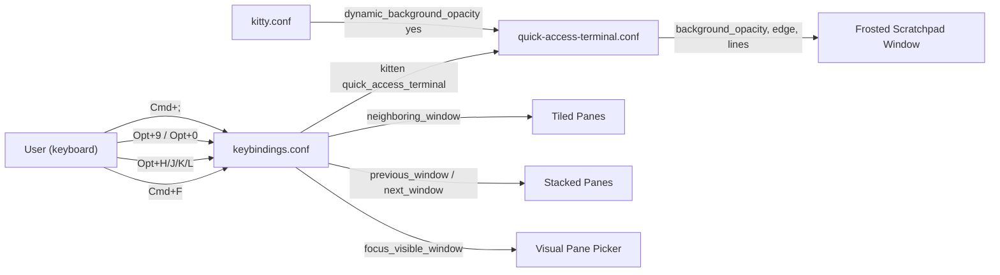
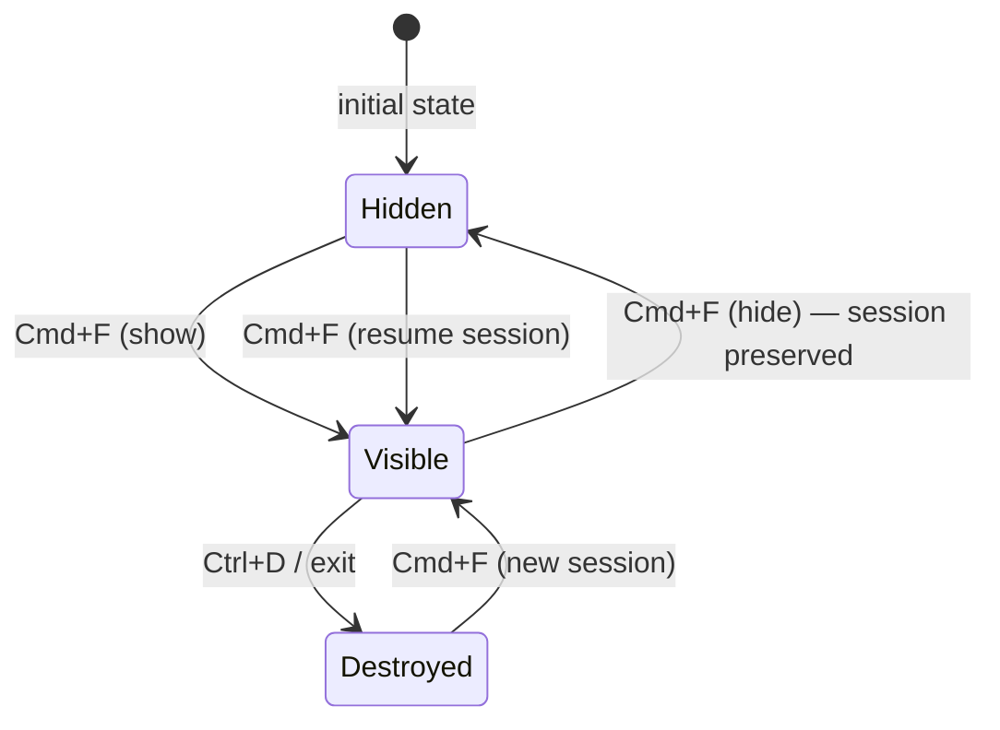

# Solution Design Document

## Validation Checklist

### CRITICAL GATES (Must Pass)

- [x] All required sections are complete
- [x] No [NEEDS CLARIFICATION] markers remain
- [x] Architecture pattern is clearly stated with rationale
- [x] All architecture decisions confirmed by user (ADR-6 through ADR-9)
- [x] Every interface has specification

### QUALITY CHECKS (Should Pass)

- [x] All context sources listed with relevance ratings
- [x] Project commands discovered from actual project files
- [x] Constraints → Strategy → Design → Implementation path is logical
- [x] Every component has directory mapping
- [x] Error handling covers all error types
- [x] A developer could implement from this design

---

## Constraints

CON-1: Kitty v0.45.0 is installed. `kitten quick_access_terminal` requires ≥ v0.42.0. ✓ Satisfied.
CON-2: `allow_remote_control yes` must remain in `kitty.conf` (set in spec 001).
CON-3: `Cmd+Shift+[/]` is already bound to tab navigation — window cycle keys must not use that combination.
CON-4: `Cmd+1-9` is bound to tab jumping — `Opt+9` / `Opt+0` must be confirmed free (no current binding uses bare `opt+9` or `opt+0`).
CON-5: All changes are config-file only — no compiled code, no system daemons.
CON-6: Split keyboard layout — brackets are on layers; `Opt+9` / `Opt+0` used instead.

---

## Implementation Context

### Required Context Sources

#### Code Context
```yaml
- file: ~/.config/kitty/kitty.conf
  relevance: HIGH
  why: "Must add dynamic_background_opacity yes for scratchpad opacity"

- file: ~/.config/kitty/keybindings.conf
  relevance: HIGH
  why: "Cmd+F binding replaced; Opt+HJKL, Opt+9/0, Cmd+; added"

- file: ~/.config/kitty/quick-access-terminal.conf
  relevance: HIGH
  why: "NEW FILE — configures scratchpad appearance (opacity, edge, size)"

- file: /Applications/kitty.app/Contents/Resources/doc/kitty/html/kittens/quick-access-terminal.html
  relevance: HIGH
  why: "Official kitten docs — edge, background_opacity, lines, columns options"
```

#### External APIs
```yaml
- service: kitty quick_access_terminal kitten
  doc: /Applications/kitty.app/Contents/Resources/doc/kitty/html/kittens/quick-access-terminal.html
  relevance: HIGH
  why: "Core mechanism for toggle + transparency"
```

### Implementation Boundaries

- **Must Preserve**: All spec 001 bindings except `map cmd+f` (replaced). `kitty.conf` structure, `theme.conf`, `KEYBINDINGS.md`.
- **Can Modify**: `keybindings.conf` (add/replace bindings), `kitty.conf` (add `dynamic_background_opacity yes`).
- **Must Not Touch**: `theme.conf` color palette, font config, tab bar config, layout list.

### External Interfaces

No external services. All changes are local Kitty config files.

### Project Commands

```bash
# Reload Kitty config (no restart needed)
Reload: Ctrl+Shift+F5  (inside Kitty)

# Test scratchpad toggle manually
Test: press Cmd+F (show), press Cmd+F again (hide), verify session persists

# Verify keybindings
Debug: kitty --debug-config  (CLI, check for parse errors)
```

---

## Solution Strategy

- **Architecture Pattern**: Config-file extension — new files added, existing files minimally modified.
- **Integration Approach**: `kitten quick_access_terminal` replaces the `launch --type=overlay` approach entirely. Vim-style navigation keys alias the existing `neighboring_window` action. Stack cycling uses `next_window`/`previous_window` on accessible keys for split keyboards.
- **Justification**: The `quick_access_terminal` kitten is native Kitty functionality — no scripting, no daemons, no remote-control polling. It provides toggle + persistence + `background_opacity` out of the box. Adding vim-style nav keys is a one-line-per-key addition to `keybindings.conf`.
- **Key Decisions**: Summarized in ADR-6 through ADR-9 below.

---

## Building Block View

### Components



### Directory Map

```
~/.config/kitty/
├── kitty.conf                         MODIFY: add dynamic_background_opacity yes
├── keybindings.conf                   MODIFY: replace cmd+f; add opt+hjkl, opt+9/0, cmd+;
├── quick-access-terminal.conf         NEW: scratchpad appearance config
├── theme.conf                         NO CHANGE
└── KEYBINDINGS.md                     MODIFY: update reference table with new bindings
```

### Interface Specifications

#### Keybinding Changes (keybindings.conf)

```yaml
# REMOVED
- map cmd+f  launch --type=overlay --title=overlay zsh

# REPLACED WITH
- map cmd+f  kitten quick_access_terminal

# ADDED — Vim spatial navigation (alias for Cmd+arrows)
- map opt+h  neighboring_window left
- map opt+j  neighboring_window down
- map opt+k  neighboring_window up
- map opt+l  neighboring_window right

# ADDED — Stack cycle navigation (split-keyboard friendly)
- map opt+9  previous_window
- map opt+0  next_window

# ADDED — Visual pane picker
- map cmd+;  focus_visible_window
```

#### kitty.conf Addition

```yaml
# Required for quick-access-terminal opacity to work
dynamic_background_opacity yes
```

#### quick-access-terminal.conf (NEW FILE)

```yaml
# Edge: top = drops down from top of screen (Quake style)
edge top

# Height: number of lines shown (approx 40% of a standard screen)
lines 15

# Opacity: 0.85 = frosted/semi-transparent (default, kept as-is)
background_opacity 0.85

# Hide when focus moves away (optional, enabled for snappy UX)
hide_on_focus_loss yes

# Override background color to slightly warmer/lifted tone vs main theme
# This adds visual distinction beyond opacity alone
kitty_override background=#1e1f2e
```

#### No Data Storage Changes

Config files only — no databases, no state files, no external services.

#### No Internal API Changes

All changes are Kitty config directives, not programmatic APIs.

---

## Runtime View

### Primary Flow: Scratchpad Toggle

```
User presses Cmd+F
    │
    ├─ Scratchpad hidden/non-existent?
    │       └─ kitten shows scratchpad window (frosted, top-anchored)
    │          Session starts fresh (first time) OR resumes (subsequent)
    │
    └─ Scratchpad currently visible?
            └─ kitten hides scratchpad window
               Shell process kept alive in background
               Session fully preserved

User presses Ctrl+D inside scratchpad
    └─ Shell process exits
       Scratchpad window closes
       Next Cmd+F press starts a fresh session
```



### Primary Flow: Stack Pane Navigation

```
User in stack layout (Cmd+Shift+F toggled on)
    │
    ├─ Opt+J / Opt+K / Opt+H / Opt+L
    │       └─ neighboring_window [direction]
    │          Silent no-op (no spatial neighbors in stack)
    │
    ├─ Opt+0 (next_window)
    │       └─ Focus shifts to next pane in tab (creation order)
    │          Previously hidden pane becomes visible
    │
    ├─ Opt+9 (previous_window)
    │       └─ Focus shifts to previous pane in tab
    │
    └─ Cmd+; (focus_visible_window)
            └─ Numbered overlays appear on each pane
               User presses number key → direct jump to that pane
               Escape → dismiss picker, no change
```

### Error Handling

| Scenario | Behavior |
|----------|----------|
| `quick_access_terminal` not found (Kitty < 0.42.0) | Kitty reports "kitten not found" — blocked by CON-1 (v0.45.0 confirmed) |
| Scratchpad process crashes mid-session | Next `Cmd+F` launches fresh session (kitten handles gracefully) |
| `dynamic_background_opacity yes` missing from kitty.conf | Opacity change at runtime silently ignored — scratchpad still works, just fully opaque |
| `Opt+9` / `Opt+0` intercepted by macOS (Option key dead key) | On macOS, `opt+9` typically produces `ª` — Kitty intercepts before system, no conflict |
| `neighboring_window` in stack layout | Silent no-op per ADR-3 (spec 001) — expected behavior |

---

## Deployment View

### Single Application Deployment

- **Environment**: Local macOS, Kitty 0.45.0
- **Configuration**: Two file edits (`kitty.conf`, `keybindings.conf`) + one new file (`quick-access-terminal.conf`)
- **Dependencies**: None beyond existing Kitty install
- **Reload**: `Ctrl+Shift+F5` reloads config in-place — no restart needed

**Deployment order**:
1. Add `dynamic_background_opacity yes` to `kitty.conf`
2. Create `quick-access-terminal.conf`
3. Update `keybindings.conf` (replace `cmd+f`, add new bindings)
4. Update `KEYBINDINGS.md` reference table
5. Reload with `Ctrl+Shift+F5`
6. Manual E2E verification

---

## Cross-Cutting Concepts

### UX Visualization

**Scratchpad state — Quake drop-down from top:**
```
┌──────────────────────────────────────────────────────────┐
│░░░░░░░░ scratchpad (frosted, 85% opacity) ░░░░░░░░░░░░░░│  ← Cmd+F shows
│  ~/projects/myapp $ git status                           │
│  On branch main...                                       │
│░░░░░░░░░░░░░░░░░░░░░░░░░░░░░░░░░░░░░░░░░░░░░░░░░░░░░░░░│
├──────────────────────────────────────────────────────────┤
│  [underlying panes — visible through frosted top]        │
│  editor / logs / shell                                   │
└──────────────────────────────────────────────────────────┘
Cmd+F again → scratchpad hides, session preserved
```

**Visual pane picker (Cmd+;):**
```
┌──────────────────────────────────────────────────────────┐
│  [1]  nvim ~/projects/...                                │
├──────────────────────────────────────────────────────────┤
│  [2]  cargo test                                         │
├──────────────────────────────────────────────────────────┤
│  [3]  git log --oneline                                  │
└──────────────────────────────────────────────────────────┘
Press 1/2/3 to jump   Esc to cancel
```

### Keybinding Conflict Audit (Complete)

| New Key | Action | Conflict Check |
|---------|--------|----------------|
| `Cmd+F` | `kitten quick_access_terminal` | Replaces existing `launch --type=overlay` — no external conflict |
| `Opt+H` | `neighboring_window left` | Free — not in keybindings.conf |
| `Opt+J` | `neighboring_window down` | Free — not in keybindings.conf |
| `Opt+K` | `neighboring_window up` | Free — not in keybindings.conf |
| `Opt+L` | `neighboring_window right` | Free — not in keybindings.conf |
| `Opt+9` | `previous_window` | Free — `Cmd+9` = goto_tab 9, not `Opt+9` |
| `Opt+0` | `next_window` | Free — `Cmd+0` not bound |
| `Cmd+;` | `focus_visible_window` | Free — not in keybindings.conf |

---

## Architecture Decisions

### ADR-6: Replace `launch --type=overlay` with `kitten quick_access_terminal`

- **Choice**: Replace `map cmd+f launch --type=overlay --title=overlay zsh` with `map cmd+f kitten quick_access_terminal`
- **Rationale**: The `quick_access_terminal` kitten (Kitty ≥ 0.42.0) provides native toggle behavior (same key open/close), session persistence across toggles, and `background_opacity 0.85` frosted appearance out of the box. Zero scripting required.
- **Trade-offs**: The scratchpad is a separate OS-level window (not an in-tab overlay) — it sits above all Kitty windows. The old `--type=overlay` was in-tab. The separate window model is actually preferred here: it's visually more distinct.
- **User confirmed**: ✓ Yes

### ADR-7: Vim-style spatial navigation — `Opt+H/J/K/L` → `neighboring_window`

- **Choice**: Add `opt+h/j/k/l` as aliases for `neighboring_window left/down/up/right`
- **Rationale**: User is vim-native and prefers HJKL directional navigation. These are additive aliases alongside existing `Cmd+arrows` — both work. Consistent with vim's hjkl = left/down/up/right spatial model.
- **Trade-offs**: In stack layout, all four keys silently no-op (same as Cmd+arrows). Stack navigation uses `Opt+9/0` and `Cmd+;` instead.
- **User confirmed**: ✓ Yes (vim-like navigation)

### ADR-8: Visual pane picker — `Cmd+;` → `focus_visible_window`

- **Choice**: Bind `cmd+;` to the built-in `focus_visible_window` action
- **Rationale**: `focus_visible_window` shows numbered overlays on each pane — the user presses a number to jump directly. Works in all layouts including stack. `Cmd+;` is free and accessible.
- **Trade-offs**: None significant. Action is built-in, no configuration needed.
- **User confirmed**: ✓ Yes

### ADR-9: Stack cycle keys — `Opt+9` (previous) / `Opt+0` (next) → `previous_window` / `next_window`

- **Choice**: Bind `opt+9` → `previous_window` and `opt+0` → `next_window`
- **Rationale**: User has a split keyboard where brackets are on layers — `Opt+9/0` are physically accessible on the base layer and mnemonic (9 before 0 = previous/next).
- **Trade-offs**: Non-obvious mnemonics to outside observers, but ergonomically correct for the user's hardware. Both keys confirmed free (no conflict with `Cmd+9` = goto_tab 9).
- **User confirmed**: ✓ Yes

---

## Quality Requirements

- **Usability**: Scratchpad visually distinct at a glance — opacity difference perceptible without needing to read a title
- **Reliability**: Session survives hide/show cycles until explicit exit — zero accidental context loss
- **Performance**: Toggle response is instantaneous (kitten is native Kitty, no subprocess startup)
- **Compatibility**: All spec 001 bindings remain functional — zero regressions

---

## Acceptance Criteria

**Scratchpad (ADR-6):**
- [ ] WHEN the user presses `Cmd+F` with no scratchpad visible, THE SYSTEM SHALL show a frosted terminal anchored to the top of the screen
- [ ] WHEN the user presses `Cmd+F` with the scratchpad visible, THE SYSTEM SHALL hide it while preserving the shell session
- [ ] WHEN the user presses `Cmd+F` after a previous hide, THE SYSTEM SHALL restore the scratchpad with the prior session intact
- [ ] THE SYSTEM SHALL render the scratchpad with `background_opacity 0.85` (visually distinct from opaque panes)
- [ ] WHEN the user presses `Ctrl+D` inside the scratchpad, THE SYSTEM SHALL terminate the session and close the window

**Vim navigation (ADR-7):**
- [ ] WHEN `opt+h` is pressed in a tiled layout with a left neighbor, THE SYSTEM SHALL focus that neighbor
- [ ] WHEN `opt+j` is pressed in a tiled layout with a lower neighbor, THE SYSTEM SHALL focus that neighbor
- [ ] WHEN `opt+k` is pressed in a tiled layout with an upper neighbor, THE SYSTEM SHALL focus that neighbor
- [ ] WHEN `opt+l` is pressed in a tiled layout with a right neighbor, THE SYSTEM SHALL focus that neighbor
- [ ] WHILE in stack layout, WHEN any `opt+hjkl` key is pressed, THE SYSTEM SHALL silently no-op

**Stack cycle (ADR-9):**
- [ ] WHEN `opt+0` is pressed, THE SYSTEM SHALL focus the next window in the tab (wraps at last)
- [ ] WHEN `opt+9` is pressed, THE SYSTEM SHALL focus the previous window in the tab (wraps at first)

**Visual picker (ADR-8):**
- [ ] WHEN `cmd+;` is pressed, THE SYSTEM SHALL display numbered overlays on each accessible pane
- [ ] WHEN a number key is pressed while the picker is shown, THE SYSTEM SHALL focus the corresponding pane
- [ ] WHEN `Escape` is pressed while the picker is shown, THE SYSTEM SHALL dismiss the picker with no state change

---

## Risks and Technical Debt

### Known Technical Issues

- `neighboring_window` no-ops in stack layout (per ADR-3 spec 001) — documented and expected; `Opt+9/0` cover stack cycling

### Implementation Gotchas

- **`dynamic_background_opacity yes`** must be in `kitty.conf` for `set_background_opacity` and runtime opacity changes to work. Without it, `background_opacity` in `quick-access-terminal.conf` still takes effect at launch — but this option is best practice to include.
- **macOS Option key dead keys**: On macOS with some keyboard layouts, `Opt+H/J/K/L` may produce special characters (ˆ, ∆, ˚, ¬). Kitty intercepts key events before the OS character mapping, so these bindings work correctly — but worth verifying during E2E on the user's specific keyboard layout.
- **`quick-access-terminal.conf` location**: Must be in `~/.config/kitty/` (same dir as `kitty.conf`). The kitten searches for it automatically.
- **`hide_on_focus_loss yes`**: Enabled in the design — the scratchpad auto-hides when focus moves to another app/window. If the user finds this annoying (e.g., accidentally triggers when switching apps), it can be set to `no`.
- **`kitty_override background=#1e1f2e`**: The slightly warmer dark background in `quick-access-terminal.conf` gives a second visual cue beyond opacity. If the user prefers the exact same Tokyonight Night `#1a1b26`, this line can be removed.

---

## Glossary

### Domain Terms

| Term | Definition | Context |
|------|------------|---------|
| Scratchpad | The persistent quick-access terminal window | Replaces spec 001's ephemeral overlay |
| Stack layout | Kitty layout mode showing one pane at a time | Toggled with `Cmd+Shift+F` |
| Toggle | Open/close with the same key | Core behavior of `quick_access_terminal` |
| Session persistence | Shell process kept alive when window is hidden | Key difference from spec 001's overlay |

### Technical Terms

| Term | Definition | Context |
|------|------------|---------|
| `quick_access_terminal` | Built-in Kitty kitten (v0.42.0+) for Quake-style toggle terminal | ADR-6 |
| `neighboring_window` | Kitty action: focus adjacent pane in a direction | ADR-7; no-ops without neighbor |
| `next_window` / `previous_window` | Kitty actions: cycle through windows in creation order | ADR-9 |
| `focus_visible_window` | Kitty action: show numbered picker overlay | ADR-8 |
| `dynamic_background_opacity` | Kitty config option enabling runtime opacity changes | Required for opacity in scratchpad |
| `hide_on_focus_loss` | `quick_access_terminal` option: auto-hide when focus leaves | Set to `yes` in design |
| `edge top` | `quick_access_terminal` option: anchor window to top of screen | Quake drop-down behavior |
