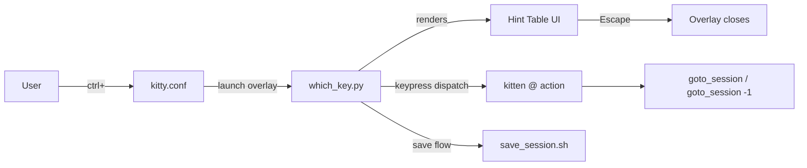
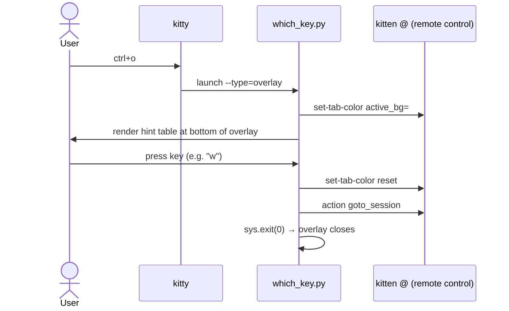
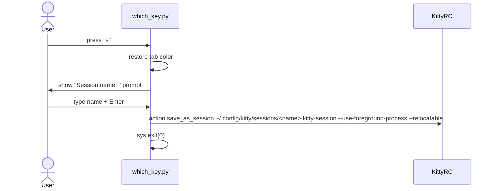

# Solution Design Document

## Validation Checklist

### CRITICAL GATES (Must Pass)

- [x] All required sections are complete
- [x] No [NEEDS CLARIFICATION] markers remain
- [x] Architecture pattern is clearly stated with rationale
- [x] All architecture decisions confirmed by user
- [x] Every interface has specification

### QUALITY CHECKS (Should Pass)

- [x] Constraints → Strategy → Design → Implementation path is logical
- [x] Every component has a directory mapping
- [x] Error handling covers all error types
- [x] A developer could implement from this design

---

## Constraints

- **CON-1** Implementation must use only kitty's native extension points: config options, Python kittens (`~/.config/kitty/*.py`), and `kitten @` remote control API.
- **CON-2** No external dependencies — no pip packages, no shell tools beyond what macOS ships with.
- **CON-3** Must not break existing behaviour from specs 001 (base config) and 002 (sessions).
- **CON-4** Kitty must be running with `allow_remote_control yes` and `listen_on unix:/tmp/kitty` (already in `kitty.conf`).

---

## Implementation Context

### Required Context Sources

```yaml
# Config files being modified
- file: ~/.config/kitty/kitty.conf
  relevance: HIGH
  why: tab_bar_edge, tab_title_template changes

- file: ~/.config/kitty/keybindings.conf
  relevance: HIGH
  why: ctrl+o binding replacement

- file: ~/.config/kitty/save_session.sh
  relevance: MEDIUM
  why: save action delegates to this existing script
```

### Implementation Boundaries

- **Must Preserve**: All existing keybindings, pane navigation (ctrl+hjkl), overlay binding (cmd+f), tab navigation, session goto_session bindings.
- **Can Modify**: `tab_title_template`, `tab_bar_edge`, the `ctrl+o` binding.
- **Must Not Touch**: `pass_keys.py`, `navigate_or_tab.py`, `theme.conf`, session files in `sessions/`.

### Project Commands

```bash
# Reload kitty config (no restart needed for most changes)
Reload: ctrl+cmd+,  (already mapped in keybindings.conf)

# Test kitten directly
Test: ~/.config/kitty/which_key.py  (run in a kitty window to preview)
```

---

## Solution Strategy

- **Architecture Pattern:** Config-driven scripting — minimal Python kitten, declarative config changes, no frameworks.
- **Integration Approach:** The `ctrl+o` binding is replaced with a single `launch --type=overlay` call. The overlay kitten owns the full interaction loop: render, capture, dispatch, exit.
- **Justification:** Keeps all logic in one file (`which_key.py`). No coordination between separate modal mapping and overlay. Self-contained and easy to extend.
- **Key Decisions:** See ADRs below — most important is ADR-1 (overlay captures input, no modal mapping needed).

---

## Building Block View

### Components



### Directory Map

```
~/.config/kitty/
├── kitty.conf              MODIFY: tab_bar_edge, tab_title_template
├── keybindings.conf        MODIFY: ctrl+o binding
├── which_key.py            NEW: hint overlay kitten
├── save_session.sh         EXISTING: no changes needed
└── sessions/               EXISTING: no changes needed
```

---

## Interface Specifications

### which_key.py — Kitten Interface

```yaml
entrypoint: main(args, answer)   # standard kitty kitten signature
args: []                          # no arguments needed; hints hardcoded
env_required:
  - KITTY_LISTEN_ON               # socket path for kitten @ dispatch
  - COLUMNS                       # terminal width for layout
  - LINES                         # terminal height for layout
exit_behaviour: always exits after one keypress (or Escape)
```

### kitten @ action — Remote Control Interface

```yaml
command: kitten @ --to $KITTY_LISTEN_ON action <action_string>
actions_used:
  - goto_session ~/.config/kitty/sessions/<name>.kitty-session
  - goto_session -1
  - set-tab-color active_bg=#<hex>   # mode indicator
  - set-tab-color reset              # restore on exit
```

### Hint Table Data Model

```python
HINTS = [
    # (key, label, action_type, action_arg)
    ("w", "session picker",  "action",  "goto_session"),
    ("l", "last session",    "action",  "goto_session -1"),
    ("s", "save session",    "save",    None),   # triggers name prompt
]
```

`action_type`:
- `"action"` — dispatch directly via `kitten @ action {action_arg}`
- `"save"` — read session name from user, then call `save_as_session`

---

## Runtime View

### Primary Flow: Pressing ctrl+o → selecting a session



### Secondary Flow: Pressing "s" (save session)



### Cancellation Flow

```
User presses Escape, ctrl+c, or unrecognised key
→ which_key.py restores tab color
→ sys.exit(0) → overlay closes, no action taken
```

### Error Handling

| Error | Handling |
|-------|----------|
| `KITTY_LISTEN_ON` not set | Print error message to overlay, exit |
| `kitten @` dispatch fails | Print error message, exit cleanly |
| User types empty name for save | Abort save, close overlay |
| Session file does not exist (goto) | kitty handles gracefully (shows empty picker or no-op) |

---

## Implementation Examples

### Example: which_key.py structure

**Why this example**: Clarifies the kitten entry point, raw keypress reading, and dispatch pattern — non-obvious for kitty kitten authors.

```python
# ~/.config/kitty/which_key.py
# Standard kitty kitten — called via: launch --type=overlay ~/...../which_key.py

import os, sys, subprocess, tty, termios

HINTS = [
    ("w", "session picker",  "action",  "goto_session"),
    ("l", "last session",    "action",  "goto_session -1"),
    ("s", "save session",    "save",    None),
]

ACCENT = "#5e81ac"   # blue — session mode active colour

def dispatch(listen_on, action_str):
    subprocess.run(["kitten", "@", "--to", listen_on, "action", action_str])

def set_tab_color(listen_on, color=None):
    if color:
        subprocess.run(["kitten", "@", "--to", listen_on,
                        "set-tab-color", f"active_bg={color}"])
    else:
        subprocess.run(["kitten", "@", "--to", listen_on,
                        "set-tab-color", "--reset"])

def read_one_key():
    fd = sys.stdin.fileno()
    old = termios.tcgetattr(fd)
    try:
        tty.setraw(fd)
        return sys.stdin.read(1)
    finally:
        termios.tcsetattr(fd, termios.TCSADRAIN, old)

def render_hints():
    cols = os.get_terminal_size().columns
    lines = os.get_terminal_size().lines
    # Position at bottom third of the overlay
    # Render bordered box with key → description pairs
    # ...
    pass

def main(args, answer):
    listen_on = os.environ.get("KITTY_LISTEN_ON", "")
    if not listen_on:
        print("Error: KITTY_LISTEN_ON not set", file=sys.stderr)
        sys.exit(1)

    set_tab_color(listen_on, ACCENT)
    render_hints()
    key = read_one_key()
    set_tab_color(listen_on)          # reset colour regardless of key

    for (k, label, atype, arg) in HINTS:
        if key == k:
            if atype == "action":
                dispatch(listen_on, arg)
            elif atype == "save":
                print("\nSession name: ", end="", flush=True)
                name = input().strip()
                if name:
                    path = os.path.expanduser(f"~/.config/kitty/sessions/{name}.kitty-session")
                    dispatch(listen_on,
                             f"save_as_session {path} --use-foreground-process --relocatable")
            sys.exit(0)

    # Unrecognised key or Escape — just exit
    sys.exit(0)
```

### Example: tab_title_template with session name

**Why this example**: The Python f-string syntax inside the template string is easy to get wrong.

```
# In kitty.conf:
# When session_name is non-empty: "work › 1: zsh"
# When no session:                "1: zsh"
tab_title_template "{(session_name + ' › ') if session_name else ''}{index}: {title}"
```

---

## Deployment View

No server, no build step, no migration. Changes deploy by reloading kitty config (`ctrl+cmd+,`). New `which_key.py` is picked up on next `ctrl+o` press. Tab colour changes are transient (in-memory only, not persisted).

---

## Cross-Cutting Concepts

### User Interface & UX

**Hint Table Layout (ASCII wireframe):**

```
┌─────────────────────────────────────────────────────┐
│                                                     │
│   (existing pane content — dimmed by overlay)       │
│                                                     │
│                                                     │
│  ╭──────────────────────────────────────────────╮  │
│  │  ctrl+o  —  session                          │  │
│  ├──────────────────────────────────────────────┤  │
│  │  w   session picker                          │  │
│  │  l   last session                            │  │
│  │  s   save session                            │  │
│  ╰──────────────────────────────────────────────╯  │
└─────────────────────────────────────────────────────┘
```

**Tab bar with session name:**

```
┌──────────────────────────────────────────────────────────┐
│  work › 1: zsh ❯  work › 2: nvim  │  work › 3: git      │  ← tab bar (top)
├──────────────────────────────────────────────────────────┤
│                                                          │
│  (terminal content)                                      │
│                                                          │
└──────────────────────────────────────────────────────────┘
```

**Tab bar with session mode active (tab colour change):**

```
┌──────────────────────────────────────────────────────────┐
│  [BLUE BG] work › 1: zsh ❯  work › 2: nvim  │ ...       │
├──────────────────────────────────────────────────────────┤
│                                                          │
│  ╭──────────────────────────────────────────────────╮   │
│  │  ctrl+o  —  session                              │   │
│  │  w   session picker                              │   │
│  │  l   last session                                │   │
│  │  s   save session                                │   │
│  ╰──────────────────────────────────────────────────╯   │
└──────────────────────────────────────────────────────────┘
```

---

## Architecture Decisions

- [ ] **ADR-1: Which-key key interception — Overlay captures input directly**
  - Choice: `launch --type=overlay which_key.py` reads keypress via `tty.setraw` inside the kitten
  - Rationale: Self-contained. No coordination needed between modal mapping and overlay lifecycle. Overlay owns its own close. No risk of orphaned overlay if modal mode exits unexpectedly.
  - Trade-offs: `kitten @` remote control must support `action goto_session` — verified in research. If a new action type is not supportable via `kitten @`, this approach needs a workaround.
  - Alternative rejected: `map --new-mode` + visual-only overlay — requires coordinating two separate systems (mode exit doesn't close overlay automatically).
  - User confirmed: ✅ 2026-03-06

- [ ] **ADR-2: Session name display — prefix in tab_title_template**
  - Choice: `tab_title_template "{(session_name + ' › ') if session_name else ''}{index}: {title}"`
  - Rationale: Native — no scripts needed. Updates automatically on session switch. Falls back gracefully when no session is active.
  - Trade-offs: All tabs in a session show the session name prefix, which is slightly redundant. Alternative (OS window title) requires a `kitten @` call on every session switch.
  - Alternative rejected: Dedicated "session tab" — not a native kitty concept; would require a permanently open dummy tab.
  - User confirmed: ✅ 2026-03-06

- [ ] **ADR-3: Hint table defined inline in which_key.py**
  - Choice: `HINTS` list hardcoded at top of `which_key.py`
  - Rationale: Single file to edit. No external config file to keep in sync. Straightforward to extend — add a tuple, add a binding in `keybindings.conf`.
  - Trade-offs: Hints and actual bindings in `keybindings.conf` can theoretically diverge. Accepted — both files are in the same directory and the user maintains both.
  - Alternative rejected: Parse `keybindings.conf` automatically — fragile, complex, not worth it for 3 bindings.
  - User confirmed: ✅ 2026-03-06

- [ ] **ADR-4: Session mode visual indicator — transient tab colour via kitten @**
  - Choice: `which_key.py` calls `kitten @ set-tab-color active_bg=#5e81ac` on overlay open, resets on close.
  - Rationale: Provides the "visual indicator that I'm in session mode" the PRD requires. Purely transient — no persistent config change. The blue tint on the active tab signals prefix mode is active.
  - Trade-offs: Tab colour is reset even if kitty crashes mid-session (tab colour is runtime state, not persisted). If `set-tab-color` is unavailable (older kitty), the indicator is simply absent — the overlay still works.
  - User confirmed: ✅ 2026-03-06

---

## Quality Requirements

- **Appearance:** Hint overlay must be visually clean — rendered box with consistent alignment. Not raw terminal output.
- **Responsiveness:** Overlay appears within one render cycle of `ctrl+o` press. No perceptible delay.
- **Resilience:** Any error in `which_key.py` must not leave kitty in a broken state — always restore tab colour before exiting, even on exception.
- **Extensibility:** Adding a new `ctrl+o` sub-binding requires editing exactly two lines: one in `keybindings.conf` (the map), one in `which_key.py` (the HINTS tuple).

---

## Acceptance Criteria

**Tab Bar Position**
- [ ] THE SYSTEM SHALL display the tab bar at the top edge of the kitty window.

**Session Name in Tab Bar**
- [ ] WHEN a session file is loaded, THE SYSTEM SHALL display the session name as a prefix in every tab title in that session.
- [ ] WHEN no session is active, THE SYSTEM SHALL display tab titles without a session prefix.

**Which-Key Overlay**
- [ ] WHEN the user presses `ctrl+o`, THE SYSTEM SHALL open a full-pane overlay displaying all available sub-commands within one render cycle.
- [ ] WHEN the overlay is visible and a recognised key is pressed, THE SYSTEM SHALL execute the corresponding action AND close the overlay.
- [ ] WHEN the overlay is visible and Escape or an unrecognised key is pressed, THE SYSTEM SHALL close the overlay without executing any action.
- [ ] WHILE the overlay is visible, THE SYSTEM SHALL display the active tab with a distinct background colour indicating session mode.
- [ ] WHEN the overlay closes (any reason), THE SYSTEM SHALL restore the active tab's background colour to default.

**Save Session Flow**
- [ ] WHEN the user presses `s` in the overlay, THE SYSTEM SHALL prompt for a session name and save to `~/.config/kitty/sessions/<name>.kitty-session`.
- [ ] IF the user provides an empty name, THE SYSTEM SHALL abort the save and close the overlay cleanly.

---

## Risks and Technical Debt

### Implementation Gotchas

- **`tty.setraw` in kitty kitten**: Kitty kittens are launched as processes with a PTY. `tty.setraw` should work but needs `sys.stdin.fileno()` — verify stdin is a TTY, not a pipe.
- **`kitten @` availability in overlay context**: The overlay is launched with `KITTY_LISTEN_ON` set. Verify this env var is populated inside overlay windows (it should be, since overlays are full kitty windows).
- **`set-tab-color --reset`**: This resets to the theme default. If the theme itself sets a custom `active_tab_background`, `--reset` should restore it. Verify against the active `theme.conf`.
- **`goto_session` via `kitten @ action`**: The exact syntax is `kitten @ action goto_session`. If `goto_session` is not supported as an `action` subcommand arg, fallback is to use `kitten @ goto-session` (hyphenated remote control command) — verify during implementation.
- **`save_as_session` with path arg**: When a path is provided, kitty saves without prompting. Verify this behaves correctly when the `sessions/` directory exists.

### Technical Debt

- The `HINTS` list in `which_key.py` must be manually kept in sync with `keybindings.conf`. This is acceptable for the current scale (3 bindings) but would need automation at 10+ bindings.

---

## Glossary

### Domain Terms

| Term | Definition | Context |
|------|------------|---------|
| Session | A named kitty workspace defined by a `.kitty-session` file, containing tabs and panes at specific directories | Loaded via `goto_session` |
| Which-key | A UI pattern where pressing a prefix key shows a popup listing all available sub-keys | Popularised by vim-which-key / lazyvim |
| Hint table | The formatted list of key → description pairs shown in the overlay | Rendered by `which_key.py` |
| Overlay | A kitty window type (`launch --type=overlay`) that floats on top of the current pane | Used for the hint menu |

### Technical Terms

| Term | Definition | Context |
|------|------------|---------|
| kitten | A Python script invokable from kitty via `kitten <name>` or `launch … <name>` | `which_key.py` is a kitten |
| `kitten @` | Kitty's remote control CLI — sends commands to a running kitty instance via socket | Used to dispatch actions and change tab colour |
| `KITTY_LISTEN_ON` | Environment variable set by kitty containing the socket path | Required for `kitten @` inside kittens |
| `tty.setraw` | Python stdlib call to put a TTY in raw mode — reads keypresses without waiting for Enter | Used in `which_key.py` for single-key capture |
| `tab_title_template` | Python f-string evaluated per tab to produce the tab's display text | Modified to include `session_name` prefix |
