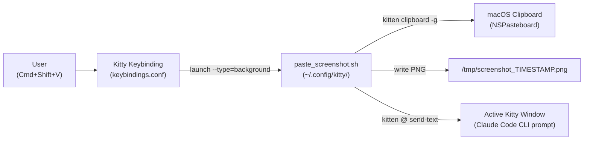
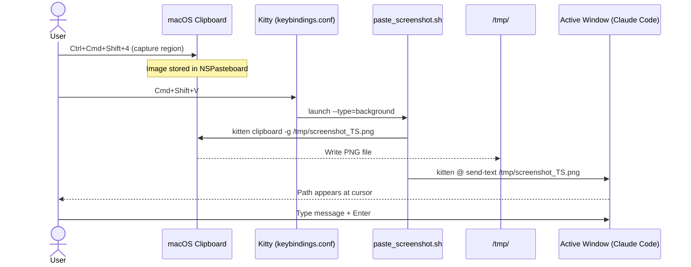

# Solution Design Document

## Validation Checklist

### CRITICAL GATES (Must Pass)

- [x] All required sections are complete
- [x] No [NEEDS CLARIFICATION] markers remain
- [x] Architecture pattern is clearly stated with rationale
- [x] All architecture decisions confirmed by user (ADR-1, ADR-2, ADR-3)
- [x] Every interface has specification

### QUALITY CHECKS (Should Pass)

- [x] All context sources are listed with relevance ratings
- [x] Constraints → Strategy → Design → Implementation path is logical
- [x] Every component in diagram has directory mapping
- [x] Error handling covers all error types
- [x] Quality requirements are specific and measurable
- [x] A developer could implement from this design

---

## Constraints

CON-1 **macOS only** — relies on macOS clipboard image format (TIFF/PNG in NSPasteboard). Not portable to Linux/Windows.

CON-2 **Kitty terminal only** — uses `kitten clipboard`, `kitten @` remote control, and Kitty's `map` keybinding mechanism. Not applicable to other terminal emulators.

CON-3 **Remote control must be enabled** — `kitty.conf` already has `allow_remote_control yes` and `listen_on unix:/tmp/kitty`. Both required for `kitten @ send-text` to work.

CON-4 **No newline appended** — the inserted path must not trigger submission; the user controls when to press Enter.

CON-5 **Claude Code accepts PNG/JPEG/GIF/WebP under 5MB** — the extracted file must be a supported format and within size limits.

---

## Implementation Context

### Required Context Sources

#### Code Context
```yaml
- file: ~/.config/kitty/keybindings.conf
  relevance: HIGH
  why: "New keybinding added here. Must follow existing section/comment conventions."

- file: ~/.config/kitty/kitty.conf
  relevance: HIGH
  why: "allow_remote_control and listen_on already set. No changes needed here."

- file: ~/.config/kitty/save_session.sh
  relevance: MEDIUM
  why: "Established pattern for helper scripts: zsh shebang, minimal logic, ~/.config/kitty/ location."
```

#### External APIs
```yaml
- service: Kitty kitten clipboard
  doc: https://sw.kovidgoyal.net/kitty/kittens/clipboard/
  relevance: HIGH
  why: "Primary extraction tool. kitten clipboard -g <file> extracts raster images."

- service: Kitty remote control (kitten @)
  doc: https://sw.kovidgoyal.net/kitty/remote-control/
  relevance: HIGH
  why: "send-text action injects path string into the active window."
```

### Implementation Boundaries

- **Must Preserve**: All existing keybindings; `clipboard_control` default (write enabled); existing `cmd+v` macOS paste behavior
- **Can Modify**: `keybindings.conf` (add new binding under CLIPBOARD section)
- **New Files**: `~/.config/kitty/paste_screenshot.sh`
- **Must Not Touch**: `kitty.conf` (already correctly configured), `theme.conf`, other pane/session scripts

### Project Commands

```bash
# No build step — config files and shell scripts
# Reload kitty config after changes:
Reload: Ctrl+Shift+F5  (or kitty +kitten @ --to unix:/tmp/kitty action "load_config_file")

# Test clipboard extraction manually:
Test:   kitten clipboard -g /tmp/test_ss.png && echo "success: $(ls -lh /tmp/test_ss.png)"

# Test remote text injection manually:
Test:   kitten @ --to unix:/tmp/kitty send-text --match window:focused "/tmp/test_ss.png"
```

---

## Solution Strategy

- **Architecture Pattern**: Shell script + Kitty keybinding hook. Single-responsibility: script handles clipboard → file, Kitty handles keypress → script → text injection.
- **Integration Approach**: The new keybinding plugs into the existing `# ─── CLIPBOARD ─────` section of `keybindings.conf`. The script follows the `save_session.sh` pattern.
- **Justification**: No new dependencies, no daemon, no background process. Pure Kitty-native mechanism using already-enabled remote control. Complexity is minimal.
- **Key Decisions**: `kitten clipboard -g` preferred over `pngpaste` because it is bundled with Kitty and requires zero installation. `kitten @ send-text` uses the existing `listen_on unix:/tmp/kitty` socket already configured in `kitty.conf`.

---

## Building Block View

### Components



### Directory Map

**Component**: kitty-config
```
~/.config/kitty/
├── keybindings.conf          # MODIFY: add cmd+shift+v binding under CLIPBOARD section
├── paste_screenshot.sh       # NEW: clipboard image → temp file → send-text
├── kitty.conf                # NO CHANGE (allow_remote_control + listen_on already set)
├── save_session.sh           # REFERENCE: script pattern to follow
└── docs/specs/004-claude-screenshot-paste/
    ├── README.md
    ├── product-requirements.md
    └── solution-design.md    # THIS FILE
```

### Interface Specifications

#### Integration Points

```yaml
# Inbound: Kitty keypress triggers background script
- trigger: "map cmd+shift+v in keybindings.conf"
  mechanism: "launch --type=background zsh ~/.config/kitty/paste_screenshot.sh"
  data_flow: "No input arguments. Script reads clipboard via kitten clipboard."

# Outbound: Script extracts clipboard image
- from: paste_screenshot.sh
  to: macOS NSPasteboard (via kitten clipboard)
  command: "kitten clipboard -g /tmp/screenshot_TIMESTAMP.png"
  behavior: "Exits with non-zero if no raster image in clipboard"

# Outbound: Script injects path into terminal
- from: paste_screenshot.sh
  to: Active Kitty window
  command: "kitten @ --to unix:/tmp/kitty send-text --match window:focused PATH"
  behavior: "Types the file path string at the current cursor position (no newline)"
```

#### Data Models

```pseudocode
# Temp file naming convention
PATTERN: /tmp/screenshot_<unix_timestamp>.png
EXAMPLE: /tmp/screenshot_1709123456.png

# Constraints:
- Always PNG format (kitten clipboard -g writes PNG regardless of clipboard format)
- Timestamp ensures uniqueness for rapid successive captures
- No spaces in path — safe for unquoted terminal input
```

### Implementation Examples

#### Example: paste_screenshot.sh logic

**Why this example**: The script has conditional error handling that must be understood before implementation.

```zsh
#!/bin/zsh
# paste_screenshot.sh — Extract clipboard image and inject path into active Kitty window

TMPFILE="/tmp/screenshot_$(date +%s).png"

# Attempt to extract image from clipboard.
# kitten clipboard -g exits non-zero if clipboard has no raster image.
if kitten clipboard -g "$TMPFILE" 2>/dev/null; then
    # Success: inject the file path at the active window's cursor (no newline).
    kitten @ --to unix:/tmp/kitty send-text --match window:focused "$TMPFILE"
else
    # No image in clipboard — silent no-op (no broken path injected).
    # Optional: add a notification here (see Could Have in PRD).
    exit 0
fi
```

#### Example: keybindings.conf addition

**Why this example**: Must follow exact section format and comment conventions of the existing file.

```
# ─── CLIPBOARD ─────────────────────────────────────────────────────────
# Copies selection and shows a macOS notification as visual feedback.
# copy_on_select (kitty.conf) handles auto-copy on highlight silently;
# this binding adds the notification for explicit Cmd+C copies.
map cmd+c combine : copy_to_clipboard : launch --type=background sh -c "osascript -e 'display notification \"Copied to clipboard\" with title \"Kitty\"'"

# Extracts clipboard screenshot (Ctrl+Cmd+Shift+4) to /tmp/screenshot_TIMESTAMP.png
# and inserts the file path at the Claude Code CLI prompt. No newline appended.
map cmd+shift+v launch --type=background zsh ~/.config/kitty/paste_screenshot.sh
```

---

## Runtime View

### Primary Flow

#### Primary Flow: User pastes screenshot into Claude Code

1. User captures region with `Ctrl+Cmd+Shift+4` → image stored in macOS clipboard (NSPasteboard)
2. User switches focus to Kitty window with Claude Code CLI prompt
3. User presses `Cmd+Shift+V`
4. Kitty triggers `launch --type=background` → spawns `paste_screenshot.sh` in background
5. Script calls `kitten clipboard -g /tmp/screenshot_1709123456.png`
6. Kitty clipboard kitten reads NSPasteboard → writes PNG file to `/tmp/`
7. Script calls `kitten @ --to unix:/tmp/kitty send-text --match window:focused "/tmp/screenshot_1709123456.png"`
8. Kitty remote control injects the path string at the cursor in the active window
9. User types their question/context, then presses Enter to send to Claude



### Error Handling

| Error Condition | Behavior | User Impact |
|---|---|---|
| Clipboard has no image (text only) | `kitten clipboard -g` exits non-zero → script exits 0 (no-op) | Nothing happens — no broken path injected |
| `kitten clipboard` not found | Script fails at line 4 → exits with error | Nothing happens (background process, silent) |
| `/tmp/` not writable | `kitten clipboard -g` fails → script no-ops | Nothing happens |
| `listen_on` socket not available | `kitten @ send-text` fails → path not injected, but file was created | File exists at `/tmp/` but user must type path manually |
| Image > 5MB | File created normally, path injected | Claude Code rejects the image when submitted — user sees Claude error |

### Complex Logic

```
ALGORITHM: paste_screenshot.sh
INPUT: macOS clipboard (NSPasteboard)
OUTPUT: PNG file at /tmp/screenshot_TIMESTAMP.png AND path string in active Kitty window

1. GENERATE unique filename using unix timestamp: /tmp/screenshot_$(date +%s).png
2. ATTEMPT clipboard extraction:
   a. Run: kitten clipboard -g TMPFILE
   b. IF exit code 0 → image extracted successfully → CONTINUE to step 3
   c. IF exit code non-zero → no image in clipboard → EXIT silently (no-op)
3. INJECT path into active window:
   a. Run: kitten @ --to unix:/tmp/kitty send-text --match window:focused TMPFILE
   b. Text is typed at cursor position with NO trailing newline
4. EXIT 0
```

---

## Deployment View

No deployment in the traditional sense — this is a local terminal configuration change.

- **Environment**: Local macOS machine, Kitty terminal config
- **Configuration**: No env vars or new `kitty.conf` settings required (remote control already enabled)
- **Dependencies**: Kitty ≥ 0.27.0 (clipboard kitten with image support); `kitten clipboard` bundled
- **Rollback**: Remove the `map cmd+shift+v` line from `keybindings.conf` and delete `paste_screenshot.sh`

---

## Cross-Cutting Concepts

### Pattern Documentation

```yaml
- pattern: "launch --type=background for side effects"
  relevance: HIGH
  why: "Existing pattern in keybindings.conf (cmd+c notification). paste_screenshot.sh follows same approach."

- pattern: "kitten @ remote control for window interaction"
  relevance: HIGH
  why: "Uses existing allow_remote_control + listen_on unix:/tmp/kitty infrastructure."

- pattern: "~/.config/kitty/*.sh helper scripts"
  relevance: MEDIUM
  why: "save_session.sh establishes convention: zsh scripts, minimal, co-located with config."
```

### System-Wide Patterns

- **Security**: No sensitive data. Script reads clipboard (user-initiated) and writes to `/tmp/`. Kitty's `clipboard_control` default (write only, no reads) is NOT affected — `kitten clipboard` uses a different mechanism than OSC 52 clipboard reads.
- **Error Handling**: Script fails silently for all error conditions (background process). No shell output visible to user unless explicitly added.
- **Performance**: Sub-100ms expected. PNG extraction is synchronous and fast; `send-text` is a local socket call.
- **Idempotency**: Each keypress creates a new unique file. Safe to press multiple times.

---

## Architecture Decisions

- [x] **ADR-1: Clipboard Extraction Tool** — `kitten clipboard -g`
  - Rationale: Bundled with Kitty, zero install required. Supports PNG, JPEG, GIF, BMP, TIFF, WebP. Works over SSH with proper config.
  - Trade-offs: Slightly less familiar syntax than `pngpaste`. If Kitty is not available (edge case), feature doesn't work.
  - User confirmed: ✅ 2026-03-06

- [x] **ADR-2: Script Location** — `~/.config/kitty/paste_screenshot.sh`
  - Rationale: Follows established `save_session.sh` pattern. Single source of truth with the Kitty config. Easy to find and edit.
  - Trade-offs: Requires a file to be created (vs inline); minor. Acceptable.
  - User confirmed: ✅ 2026-03-06

- [x] **ADR-3: Keybinding** — `cmd+shift+v`
  - Rationale: Intuitive as "special paste". Does not conflict with existing bindings (`cmd+v` is macOS default paste, `ctrl+shift+v` is Kitty's built-in paste). Follows macOS modifier conventions.
  - Trade-offs: None identified. `cmd+shift+v` is unbound in the current config.
  - User confirmed: ✅ 2026-03-06

---

## Quality Requirements

- **Performance**: Path appears at cursor within 500ms of keypress (typically < 100ms on local machine)
- **Reliability**: Zero false insertions — if no image in clipboard, no path is injected
- **Usability**: Single keypress, zero prompts, zero configuration by user after setup
- **Idempotency**: Multiple rapid presses create multiple unique files; each works independently
- **Cleanup**: Files accumulate in `/tmp/` — macOS cleans `/tmp/` on reboot; no active cleanup required for normal use

---

## Acceptance Criteria

**Main Flow Criteria**
- [x] WHEN `Cmd+Shift+V` is pressed with a clipboard image, THE SYSTEM SHALL create a PNG file at `/tmp/screenshot_<timestamp>.png`
- [x] WHEN the PNG file is created successfully, THE SYSTEM SHALL type the absolute file path at the current cursor position in the active Kitty window
- [x] THE SYSTEM SHALL NOT append a newline after the path
- [x] THE SYSTEM SHALL use a unique filename for each invocation (timestamp-based)

**Error Handling Criteria**
- [x] WHEN `Cmd+Shift+V` is pressed and clipboard contains no image, THE SYSTEM SHALL exit silently without typing anything
- [x] WHEN clipboard extraction fails for any reason, THE SYSTEM SHALL NOT inject a broken or partial path
- [x] IF `kitten @` send-text fails (socket unavailable), THEN THE SYSTEM SHALL exit cleanly (file may exist but no path injected)

**Edge Case Criteria**
- [x] WHILE multiple screenshots are taken in rapid succession, THE SYSTEM SHALL create separate uniquely-named files for each
- [x] IF the resulting PNG file exceeds Claude API's 5MB limit, THEN the system creates the file normally — the user receives feedback from Claude Code at submission time

---

## Risks and Technical Debt

### Known Technical Issues

- Claude Code CLI's native `Ctrl+V` clipboard paste has multiple open bugs on macOS (GitHub issues #1361, #2102, #12644). This solution deliberately bypasses that path entirely.
- `kitten clipboard -g` behavior when clipboard has both image and text: it extracts the image (not text). This is correct behavior for our use case.

### Implementation Gotchas

- **`window:focused` vs `window:active`**: Kitty's `send-text` target matcher must use `window:focused` (not `window:active`) to target the window that triggered the keybinding. Since the script runs as a background process, the original window remains focused.
- **`--to unix:/tmp/kitty` is required**: `kitten @` without `--to` defaults to looking for a socket from environment variables. Explicit socket path avoids issues when running from background process context.
- **Timestamp collision**: `date +%s` has 1-second resolution. Pressing the keybinding twice in the same second generates the same filename. Mitigation: add `$$` (PID) suffix if needed (`screenshot_$(date +%s)_$$.png`).
- **`kitten clipboard` writes PNG regardless of clipboard source format**: macOS screenshots captured with `Ctrl+Cmd+Shift+4` are stored as TIFF in NSPasteboard but `kitten clipboard -g` converts them to PNG. Output is always PNG.

### Technical Debt

None introduced — this is purely additive (new script + one new keybinding line).

---

## Glossary

### Domain Terms

| Term | Definition | Context |
|------|------------|---------|
| NSPasteboard | macOS system clipboard abstraction | Where `Ctrl+Cmd+Shift+4` stores screenshots |
| Raster image | Pixel-based image (PNG, JPEG, GIF, BMP, TIFF, WebP) | As opposed to vector. `kitten clipboard -g` handles raster only |

### Technical Terms

| Term | Definition | Context |
|------|------------|---------|
| `kitten clipboard -g` | Kitty bundled tool to extract clipboard data to file | Primary extraction mechanism |
| `kitten @` | Kitty remote control CLI for sending commands to a running Kitty instance | Used to inject text into the active window |
| `listen_on unix:/tmp/kitty` | Kitty config that opens a Unix socket for remote control | Already enabled in kitty.conf; required for `kitten @ send-text` |
| `launch --type=background` | Kitty action that runs a command without opening a new window | Used for side-effect-only scripts |
| `send-text` | Kitty remote control action that types a string at the current cursor | Text injection mechanism |
| `window:focused` | Kitty window matcher targeting the currently focused window | Ensures path is injected into the correct pane |
