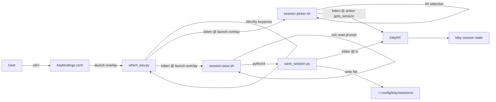
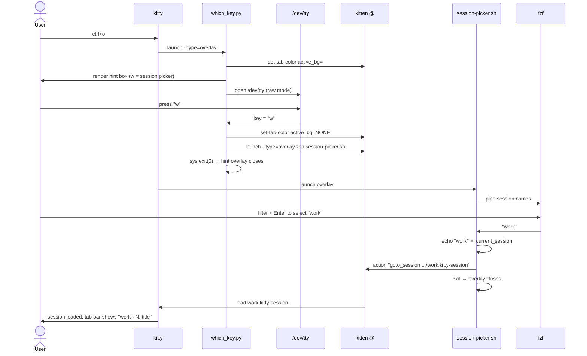
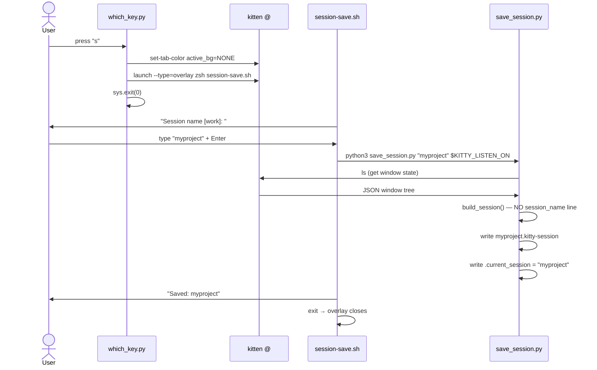

# Solution Design Document

## Validation Checklist

### CRITICAL GATES (Must Pass)

- [x] All required sections are complete
- [x] No [NEEDS CLARIFICATION] markers remain
- [x] Architecture pattern is clearly stated with rationale
- [x] All architecture decisions confirmed by user
- [x] Every interface has specification

### QUALITY CHECKS (Should Pass)

- [x] Constraints → Strategy → Design → Implementation path is logical
- [x] Every component has a directory mapping
- [x] Error handling covers all error types
- [x] A developer could implement from this design
- [x] Implementation examples use verified API syntax

---

## Constraints

- **CON-1** Only kitty-native extension points: config options, Python kittens, shell scripts, `kitten @` remote control API.
- **CON-2** No pip packages. No Python imports beyond stdlib. Shell scripts may use `fzf` (confirmed at `/opt/homebrew/bin/fzf`).
- **CON-3** Must not break specs 001 and 002: all keybindings (pane nav, tab nav, layout, scratchpad), theme, fonts, layouts, remote control socket.
- **CON-4** Must not modify: `pass_keys.py`, `navigate_or_tab.py`, `theme.conf`, `quick-access-terminal.conf`.
- **CON-5** `allow_remote_control yes` and `listen_on unix:/tmp/kitty` must remain in `kitty.conf`.

---

## Implementation Context

### Required Context Sources

```yaml
- file: ~/.config/kitty/which_key.py
  relevance: HIGH
  why: Being replaced/fixed — understand all existing logic before modifying

- file: ~/.config/kitty/kitty.conf
  relevance: HIGH
  why: tab_bar_edge, active_tab_title_template, allow_remote_control changes

- file: ~/.config/kitty/keybindings.conf
  relevance: MEDIUM
  why: ctrl+o binding must remain unchanged; verify no conflicts introduced

- file: ~/.config/kitty/sessions/kitty.kitty-session
  relevance: HIGH
  why: Must be fixed — remove invalid session_name line on line 1

- file: ~/.config/kitty/sessions/work.kitty-session
  relevance: HIGH
  why: Must be audited — may also have invalid session_name line
```

### Implementation Boundaries

- **Must Preserve**: All spec 001/002 keybindings, theme colors, font settings, `allow_remote_control`, `listen_on`, powerline tab style, layout order.
- **Can Modify**: `which_key.py` (full rewrite of input handling and dispatch), `kitty.conf` (tab title template, set-tab-color reset fix), `keybindings.conf` (only the `ctrl+o` line if needed).
- **Must Not Touch**: `pass_keys.py`, `navigate_or_tab.py`, `theme.conf`, `quick-access-terminal.conf`.
- **New Files**: `session-picker.sh`, `session-save.sh`, `save_session.py`.
- **Migration**: Strip `session_name` line from existing `.kitty-session` files.

### Project Commands

```bash
# Reload kitty config (no restart needed)
Reload: ctrl+cmd+,

# Verify kitten syntax
Verify: python3 -c "import which_key"    # no syntax errors
        python3 -c "import save_session"  # no syntax errors

# Test remote control (verify socket is live)
Check:  kitten @ --to unix:/tmp/kitty ls | python3 -m json.tool | head -10

# Manually test picker overlay
Test:   kitten @ --to unix:/tmp/kitty launch --type=overlay \
          zsh ~/.config/kitty/session-picker.sh

# Manually test save overlay
Test:   kitten @ --to unix:/tmp/kitty launch --type=overlay \
          zsh ~/.config/kitty/session-save.sh
```

---

## Solution Strategy

- **Architecture Pattern:** Two-stage overlay delegation — `which_key.py` handles the hint display and single-key dispatch only; interactive sub-actions (picker, save) are delegated to separate shell overlay processes via `kitten @ launch`.
- **Integration Approach:** `which_key.py` remains the `ctrl+o` keybinding target. It renders the hint table, reads one key via `/dev/tty` (bypassing stdin TTY issues), then dispatches to `session-picker.sh` or `session-save.sh` by launching a new overlay. Session file generation is extracted to `save_session.py`.
- **Justification:** Mixing single-key raw input with line-buffered input in the same Python process (the root cause of the current UX bug) is eliminated by delegating each interaction mode to the process type best suited for it. Shell scripts handle line input natively; Python handles JSON and file generation.
- **Key Decisions:** ADR-1 (`/dev/tty`), ADR-2 (fzf picker), ADR-3 (shell save overlay), ADR-4 (no `session_name` in files), ADR-5 (remove `l` binding).

---

## Building Block View

### Components



### Directory Map

```
~/.config/kitty/
├── kitty.conf                  MODIFY: active_tab_title_template (verify {session_name})
├── keybindings.conf            NO CHANGE: ctrl+o binding already correct
├── which_key.py                REWRITE: /dev/tty input, simplified HINTS (w+s only),
│                                         dispatch via kitten @ launch, fix set-tab-color reset
├── session-picker.sh           NEW: fzf-based picker; reads sessions dir; dispatches goto_session
├── session-save.sh             NEW: zsh read prompt; calls save_session.py
├── save_session.py             NEW: extracted from which_key.py; no session_name directive
├── .current_session            EXISTING: sidecar file tracking last loaded session (keep)
└── sessions/
    ├── kitty.kitty-session     MIGRATE: remove line 1 (session_name kitty)
    └── work.kitty-session      MIGRATE: audit and remove session_name line if present
```

---

## Interface Specifications

### which_key.py — Kitten Interface

```yaml
entrypoint: main(args, answer)   # standard kitty kitten signature
args: []                          # no arguments needed
env_required:
  - KITTY_LISTEN_ON               # socket path; fallback: unix:/tmp/kitty
input: /dev/tty                   # controlling terminal (NOT sys.stdin)
exit_behaviour: always exits after one keypress
hints:
  - w: launch session-picker.sh overlay
  - s: launch session-save.sh overlay
  - any other key / Escape: close with no action
```

### session-picker.sh — Shell Interface

```yaml
invocation: zsh ~/.config/kitty/session-picker.sh
env_required:
  - KITTY_LISTEN_ON               # set by kitty in launched overlay environment
input: fzf (interactive, handles its own TTY)
session_source: ~/.config/kitty/sessions/*.kitty-session
current_session: ~/.config/kitty/.current_session
on_select: kitten @ --to $KITTY_LISTEN_ON action "goto_session <path>"
           echo "$name" > ~/.config/kitty/.current_session
on_cancel: fzf returns empty → exit 0 (no action)
on_empty: display "(no sessions saved)" and exit
```

### session-save.sh — Shell Interface

```yaml
invocation: zsh ~/.config/kitty/session-save.sh
env_required:
  - KITTY_LISTEN_ON               # set by kitty in launched overlay environment
input: zsh read builtin (line-buffered, handles TTY correctly)
prompt: "Session name [<current>]: " (if current session known)
        "Session name: " (if no current session)
on_confirm: python3 ~/.config/kitty/save_session.py "$name" "$KITTY_LISTEN_ON"
on_empty_input: exit 0 (no save)
```

### save_session.py — Script Interface

```yaml
invocation: python3 ~/.config/kitty/save_session.py <name> <listen_on>
args:
  name: string       # session name (becomes filename)
  listen_on: string  # kitty socket path (e.g. unix:/tmp/kitty)
output_file: ~/.config/kitty/sessions/<name>.kitty-session
sidecar_write: ~/.config/kitty/.current_session  (writes name on success)
exit_codes:
  0: success
  1: error (message printed to stderr)
```

### kitten @ Remote Control — Verified API

```yaml
# Session loading (VERIFIED WORKING)
command: kitten @ --to $LISTEN_ON action "goto_session <path>"
notes: "Path must be the full .kitty-session file path. Works in kitty 0.45.0."

# Tab colour change (VERIFIED WORKING)
set_accent: kitten @ --to $LISTEN_ON set-tab-color "active_bg=#5e81ac"
reset:      kitten @ --to $LISTEN_ON set-tab-color "active_bg=NONE"
notes: "--reset flag does NOT exist. Use active_bg=NONE to revert to theme default."

# Launch new overlay from within overlay (DESIGN CHOICE)
command: kitten @ --to $LISTEN_ON launch --type=overlay zsh <script>
notes: "Launches overlay on the parent window. which_key.py then calls sys.exit(0)."

# Read current window state
command: kitten @ --to $LISTEN_ON ls
output: JSON array of OS windows with tabs and windows
```

### Session File Format — Verified Valid Commands

```yaml
# Valid kitty session directives (verified against kitty 0.45.0 session.py)
valid_commands:
  - new_tab
  - layout <name>
  - enabled_layouts <comma-list>
  - cd <directory>
  - launch [options] <command>
  - focus
  - focus_tab <index>
  - set_layout_state <json>

invalid_commands:
  - session_name   # NOT valid — causes ValueError: Unknown command in session file
```

---

## Runtime View

### Primary Flow: ctrl+o → w → select session → load



### Secondary Flow: ctrl+o → s → save session



### Cancellation Flow

```
User presses Escape in which_key.py or unrecognised key
→ which_key.py: set-tab-color active_bg=NONE (in finally block)
→ sys.exit(0) → hint overlay closes, no action

User presses ctrl+c or Escape in fzf picker
→ fzf returns empty string → session-picker.sh: [[ -z "$selected" ]] && exit 0
→ overlay closes, no goto_session dispatched

User provides empty name in session-save.sh
→ [[ -z "$name" ]] && exit 0
→ overlay closes, no file written
```

### Error Handling

| Error | Handling |
|-------|----------|
| `KITTY_LISTEN_ON` not set in which_key.py | Fallback to `unix:/tmp/kitty`; if that also fails, print error and exit |
| `KITTY_LISTEN_ON` not set in shell scripts | Default to `unix:/tmp/kitty` via `${KITTY_LISTEN_ON:-unix:/tmp/kitty}` |
| `kitten @` dispatch fails | Session-picker and save scripts: message printed; overlay exits cleanly |
| `kitten @ ls` fails in save_session.py | Print error to stderr; exit 1; save-overlay script shows error |
| Session file does not exist (load) | kitty handles error natively (shows error dialog); not our concern |
| No sessions saved (picker) | session-picker.sh shows "(no sessions saved)"; waits for Enter; exits |
| fzf not found | session-picker.sh: `command -v fzf` check; fallback error message |
| Empty session name (save) | Exit 0, no file written |
| save_session.py write fails (permissions) | Print OSError to stderr; session-save.sh propagates exit code |

---

## Deployment View

No server, no build step, no migration script required. All files are in `~/.config/kitty/`. Changes take effect:
- `which_key.py`: on next `ctrl+o` press (no reload needed — Python process is re-spawned each time).
- `session-picker.sh`, `session-save.sh`, `save_session.py`: on next invocation (no reload needed).
- `kitty.conf` changes: after `ctrl+cmd+,` (config reload).
- Session file fixes: immediate (files are read on load, not cached).

**Migration step**: Existing session files must have their `session_name` line removed before any load is attempted. This is a one-time file edit, not a migration script.

---

## Cross-Cutting Concepts

### User Interface & UX

**Hint overlay layout (unchanged from spec 003):**

```
┌─────────────────────────────────────────────────────┐
│                                                     │
│   (existing pane content — dimmed by overlay)       │
│                                                     │
│  ╭──────────────────────────────────────────────╮  │
│  │         ctrl+o  —  session                   │  │
│  ├──────────────────────────────────────────────┤  │
│  │  w   session picker                          │  │
│  │  s   save session                            │  │
│  ╰──────────────────────────────────────────────╯  │
└─────────────────────────────────────────────────────┘
```

**fzf picker overlay:**

```
┌─────────────────────────────────────────────────────┐
│  ctrl+o  —  load session                            │  ← fzf header
│  ─────────────────────────────────────────────────  │
│  ● work                                             │  ← current session (●)
│    dotfiles                                         │
│    sandbox                                          │
│  ─────────────────────────────────────────────────  │
│  session > _                                        │  ← fzf prompt
└─────────────────────────────────────────────────────┘
```

**Tab bar with session name (unchanged from spec 003):**

```
┌────────────────────────────────────────────────────┐
│  work › 1: kitty ❯  work › 2: nvim │ work › 3: zsh │  ← tab bar (top)
├────────────────────────────────────────────────────┤
│  (terminal content)                                 │
└────────────────────────────────────────────────────┘
```

### System-Wide Patterns

- **Error handling:** All shell scripts use `|| exit 0` on non-critical failures and `|| exit 1` on critical ones. Python scripts use try/except with stderr output.
- **Tab colour guard:** `which_key.py` wraps the render+read in a `try/finally` block to guarantee `set-tab-color active_bg=NONE` is always called, even on exception.
- **No orphaned overlays:** Each launched overlay owns its own lifecycle. which_key.py calls `sys.exit(0)` after dispatching, ensuring the hint overlay always closes.

---

## Implementation Examples

### Example: which_key.py — /dev/tty key reading

**Why this example**: The critical fix. Shows exactly how to bypass the stdin-is-not-a-TTY overlay issue.

```python
def read_one_key():
    """Read a single keypress from the controlling terminal.

    FIX: Open /dev/tty directly instead of using sys.stdin.
    In kitty overlay context, sys.stdin may not be a TTY (connected to a pipe
    or /dev/null). /dev/tty is the controlling terminal — always a TTY.
    """
    with open('/dev/tty', 'rb') as tty_fd:
        fd = tty_fd.fileno()
        old = termios.tcgetattr(fd)
        try:
            tty.setraw(fd)
            return tty_fd.read(1).decode('utf-8', errors='replace')
        finally:
            termios.tcsetattr(fd, termios.TCSADRAIN, old)
```

### Example: which_key.py — dispatch via kitten @ launch

**Why this example**: The two-stage pattern. Shows how to open a new overlay and exit the current one atomically.

```python
def main(args, answer):
    listen_on = os.environ.get("KITTY_LISTEN_ON", "unix:/tmp/kitty")

    set_tab_color(listen_on, ACCENT_COLOR)

    try:
        render_hints()
        key = read_one_key()
    finally:
        set_tab_color(listen_on)   # always reset, even on exception

    for (k, _label, atype) in HINTS:
        if key != k:
            continue

        script = os.path.expanduser(f"~/.config/kitty/session-{atype}.sh")
        # Launch the sub-action as a NEW overlay, then exit this one.
        # kitty @ launch --type=overlay opens on the parent window.
        # sys.exit(0) closes the which_key overlay.
        _rc(listen_on, "launch", "--type=overlay", "zsh", script)
        sys.exit(0)

    sys.exit(0)  # unrecognised key or Escape
```

Note: `atype` values are `"pick"` and `"save"`, matching scripts `session-pick.sh` and `session-save.sh`.

### Example: session-picker.sh — fzf with current session marker

**Why this example**: Documents the fzf flags needed for the desired layout and the current-session marker pattern.

```bash
#!/usr/bin/env zsh
SESSIONS_DIR="$HOME/.config/kitty/sessions"
CURRENT_SESSION_FILE="$HOME/.config/kitty/.current_session"
LISTEN_ON="${KITTY_LISTEN_ON:-unix:/tmp/kitty}"
FZF="$(command -v fzf)" || { echo "fzf not found"; read -k1; exit 1; }

# List saved sessions
sessions=("$SESSIONS_DIR"/*.kitty-session(N))
if [[ ${#sessions[@]} -eq 0 ]]; then
    echo "(no sessions saved — press any key)"
    read -k1
    exit 0
fi

current="$(cat "$CURRENT_SESSION_FILE" 2>/dev/null)"

# Build display list with current-session marker
lines=()
for f in "${sessions[@]}"; do
    name="${${f:t}%.kitty-session}"
    [[ "$name" == "$current" ]] && lines+=("● $name") || lines+=("  $name")
done

selected=$(printf '%s\n' "${lines[@]}" | "$FZF" \
    --prompt='session > ' \
    --no-info \
    --height=100% \
    --layout=reverse \
    --border=rounded \
    --header='ctrl+o  —  load session  (Esc to cancel)')

[[ -z "$selected" ]] && exit 0

# Strip marker prefix
name="${selected#● }"
name="${name#  }"

# Update tracker and load session
echo "$name" > "$CURRENT_SESSION_FILE"
kitten @ --to "$LISTEN_ON" action "goto_session $SESSIONS_DIR/$name.kitty-session"
```

### Example: save_session.py — session file generation without session_name

**Why this example**: The critical fix. The ONLY change from the current broken implementation is the removal of `session_name {name}` from the `lines` list.

```python
def build_session(state, name):
    """Generate valid kitty session file content.

    FIX: Do NOT write 'session_name {name}' — that command does not exist in
    kitty's session file syntax and causes:
        ValueError: Unknown command in session file: session_name

    The session name is encoded in the FILENAME (name.kitty-session), which
    kitty uses to populate {session_name} in tab_title_template automatically.
    """
    lines = []   # ← WAS: [f"session_name {name}", ""]  — REMOVED

    os_win = next((w for w in state if w.get("is_focused")), state[0] if state else None)
    if not os_win:
        return None

    focused_tab_idx = 1
    for tab_idx, tab in enumerate(os_win.get("tabs", [])):
        if tab_idx > 0:
            lines += ["", "new_tab"]

        layout  = tab.get("layout", "tall")
        enabled = ",".join(tab.get("enabled_layouts", ["tall"]))
        lines += [f"layout {layout}", f"enabled_layouts {enabled}"]

        windows = [w for w in tab.get("windows", []) if not w.get("is_self")]

        if windows:
            lines += [f"cd {windows[0]['cwd']}", ""]

        for win in windows:
            parts = ["launch"]
            title = win.get("title", "")
            if title:
                parts.append(f"--title={title}")
            parts.extend(win.get("cmdline", ["/bin/zsh"]))
            lines.append(" ".join(parts))

        if tab.get("is_focused"):
            focused_tab_idx = tab_idx + 1
        lines.append("focus")

    if focused_tab_idx > 1:
        lines += ["", f"focus_tab {focused_tab_idx}"]

    return "\n".join(lines) + "\n"
```

### Example: set-tab-color reset — verified correct syntax

**Why this example**: The current code uses `--reset` which doesn't exist. Documents the fix.

```python
def set_tab_color(listen_on, color=None):
    if color:
        _rc(listen_on, "set-tab-color", f"active_bg={color}")
    else:
        # FIX: --reset does not exist in kitten @ set-tab-color
        # Use active_bg=NONE to revert to theme default color.
        _rc(listen_on, "set-tab-color", "active_bg=NONE")
```

---

## Architecture Decisions

- [x] **ADR-1: Hint key input — open /dev/tty directly**
  - Choice: `open('/dev/tty', 'rb')` instead of `sys.stdin` for keypress reading in `which_key.py`
  - Rationale: `/dev/tty` is the process's controlling terminal — guaranteed to be a real TTY regardless of how stdin is wired. In kitty overlay context, stdin may be `/dev/null` or a pipe; `/dev/tty` is always the physical terminal.
  - Trade-offs: Requires the process to have a controlling terminal (it does — kitty launches overlays with a PTY). Non-issue for interactive terminal use.
  - Alternative rejected: Rewrite as shell script — loses Python's bordered-box rendering.
  - User confirmed: ✅ 2026-03-06

- [x] **ADR-2: Session picker — fzf in a new shell overlay**
  - Choice: `which_key.py` dispatches to a new overlay running `session-picker.sh`, which uses `fzf` for interactive selection.
  - Rationale: `fzf` handles its own TTY input correctly; provides arrow-key navigation, fuzzy search, and current-session marker. Eliminates the terminal state corruption that plagued the Python `input()` approach. `fzf` confirmed available at `/opt/homebrew/bin/fzf`.
  - Trade-offs: Adds a dependency on `fzf`. Script includes `command -v fzf` check with graceful fallback error. If fzf is removed, the picker breaks — mitigated by the check.
  - Alternative rejected: Number-based prompt with `/dev/tty` fix — functional but worse UX than fzf.
  - User confirmed: ✅ 2026-03-06

- [x] **ADR-3: Save prompt — new shell overlay with zsh read**
  - Choice: `which_key.py` dispatches to a new overlay running `session-save.sh`, which uses `zsh read` for the name prompt.
  - Rationale: Shell's `read` builtin uses the shell's own TTY handling — no manual `tty.setraw`, no terminal state corruption. Separating save into its own overlay process eliminates the mixed-input-mode bug (raw single key + line-buffered input in same Python process).
  - Trade-offs: Requires two overlays sequentially (hint → save). Negligible overhead.
  - Alternative rejected: Inline in `which_key.py` after `/dev/tty` fix — keeps one file but mixes two TTY modes; higher risk of future bugs.
  - User confirmed: ✅ 2026-03-06

- [x] **ADR-4: Session file format — remove session_name directive entirely**
  - Choice: `save_session.py:build_session()` starts with `lines = []` — no `session_name {name}` line.
  - Rationale: `session_name` is not a valid kitty session file directive. Its presence causes `ValueError: Unknown command in session file: session_name` on every session load. The session name is already encoded in the filename (`work.kitty-session` → `{session_name}` = `work`) — no explicit declaration needed.
  - Trade-offs: The `.current_session` sidecar file is still needed to track which session is active for the picker's `●` indicator — the filename alone doesn't tell us which session is currently loaded.
  - Alternative rejected: Write as comment (`# session_name work`) — comment has no effect; adds noise.
  - User confirmed: ✅ 2026-03-06

- [x] **ADR-5: Remove "last session" (l) hint binding**
  - Choice: Simplify HINTS to `[("w", "session picker", "pick"), ("s", "save session", "save")]`. The `l = goto_session -1` entry is removed.
  - Rationale: User preference — the fzf picker is fast enough that a dedicated "last session" shortcut adds more surface to memorise than it saves. Keeping only two bindings makes the hint overlay maximally simple.
  - Trade-offs: Users who frequently toggle between exactly two sessions lose the single-key shortcut.
  - Alternative rejected: Keep `l` — rejected by user.
  - User confirmed: ✅ 2026-03-06

---

## Quality Requirements

- **Reliability:** Session load succeeds 100% of the time for files generated by this system. No `ValueError` from invalid session file commands.
- **Responsiveness:** Hint overlay appears within one render cycle of `ctrl+o`. fzf picker appears within one render cycle of `w`. No perceptible delay.
- **Resilience:** Any exception in `which_key.py` must not leave the tab colour in accent state — the `try/finally` guard ensures `set-tab-color active_bg=NONE` always runs.
- **Graceful degradation:** If `fzf` is not found, picker shows a clear error message and waits for a keypress before closing. If `KITTY_LISTEN_ON` is not set, scripts fallback to `unix:/tmp/kitty`.

---

## Acceptance Criteria

**Session File Correctness**
- [ ] THE SYSTEM SHALL write session files containing only valid kitty session directives (no `session_name` line).
- [ ] WHEN a session file is loaded via the picker, THE SYSTEM SHALL load it without any `ValueError` or error dialog.

**Hint Overlay**
- [ ] WHEN the user presses `ctrl+o`, THE SYSTEM SHALL display a hint overlay that remains visible until a key is pressed.
- [ ] WHEN the hint overlay is visible and the user presses `Escape` or an unrecognised key, THE SYSTEM SHALL close the overlay without any action.
- [ ] WHEN the hint overlay closes (any reason), THE SYSTEM SHALL restore the active tab's background colour to default.

**Session Picker**
- [ ] WHEN the user presses `w` in the hint overlay, THE SYSTEM SHALL open an fzf picker displaying all saved sessions.
- [ ] WHEN the user selects a session and presses Enter, THE SYSTEM SHALL load that session and update the tab bar.
- [ ] WHEN the user presses Escape in the picker, THE SYSTEM SHALL close the picker without loading any session.

**Save Flow**
- [ ] WHEN the user presses `s` in the hint overlay, THE SYSTEM SHALL open a save prompt that correctly accepts keyboard input.
- [ ] WHEN the user types a name and presses Enter, THE SYSTEM SHALL write a valid `.kitty-session` file and the session SHALL appear in the picker immediately.
- [ ] IF the user submits an empty name, THE SYSTEM SHALL close the overlay without writing any file.

**Tab Bar**
- [ ] WHEN a session is loaded, THE SYSTEM SHALL display the session name as a prefix on every tab title.
- [ ] WHILE no named session is active, THE SYSTEM SHALL display tab titles without any session prefix.

---

## Risks and Technical Debt

### Known Technical Issues

- BUG #1 (CRITICAL): `session_name` in generated files — fixed by ADR-4.
- BUG #2 (MAJOR): `read_one_key()` / `read_line()` TTY failure — fixed by ADR-1, ADR-3.
- BUG #3 (MODERATE): `set-tab-color --reset` syntax wrong — fixed in `set_tab_color()` example above.
- BUG #4 (MINOR): Redundant `fn = subprocess.run` in `_rc()` — clean up during rewrite.
- EXISTING FILES: `kitty.kitty-session` and `work.kitty-session` have `session_name` on line 1 — must be stripped before any load is attempted.

### Implementation Gotchas

- **`{session_name}` vs `{session}` in tab_title_template**: The current `active_tab_title_template` uses `session_name`. Based on research, this is the correct variable (filename-derived). However, it has never been verified in a working state since sessions were always broken. Verify during Phase 1 implementation that tab titles show the session prefix after a successful load.
- **Two overlays briefly visible**: When `which_key.py` dispatches `kitten @ launch --type=overlay` then immediately calls `sys.exit(0)`, there will be one render cycle where both overlays are open. This is expected and imperceptible in practice.
- **fzf rendering in full overlay**: Use `--height=100%` and `--layout=reverse` for fzf to ensure it renders correctly in the full-screen overlay.
- **Script must be executable**: `session-picker.sh` and `session-save.sh` must have `chmod +x` or be invoked as `zsh <path>` (prefer explicit `zsh` invocation for reliability).
- **`.current_session` sidecar file race**: If the user loads a session from one window while another is running, the sidecar file may be stale. Acceptable at single-user scale.

---

## Glossary

### Domain Terms

| Term | Definition | Context |
|------|------------|---------|
| Session | A named kitty workspace defined by a `.kitty-session` file, containing tab and window layout with working directories | Loaded via `goto_session` action |
| Hint overlay | A full-screen kitty overlay showing available `ctrl+o` sub-commands | Rendered by `which_key.py` |
| Picker overlay | A kitty overlay running fzf showing the list of saved sessions | Rendered by `session-picker.sh` |
| Save overlay | A kitty overlay showing a name prompt for saving the current workspace | Rendered by `session-save.sh` |

### Technical Terms

| Term | Definition | Context |
|------|------------|---------|
| `/dev/tty` | The controlling terminal device — always a real TTY regardless of stdin redirection | Used in `read_one_key()` to bypass overlay stdin issues |
| `kitten @` | Kitty's remote control CLI — sends commands to a running kitty instance via socket | Used to dispatch actions, change tab colour, and launch sub-overlays |
| `{session_name}` | kitty tab_title_template variable — automatically set to the `.kitty-session` filename (without extension) when a session is loaded | Provides "work ›" prefix in tab bar without any session file command |
| CTTY | Controlling terminal — the terminal device associated with a process's session leader | `/dev/tty` provides access to the CTTY |
| `fzf` | Command-line fuzzy finder — used for interactive session selection | Confirmed at `/opt/homebrew/bin/fzf` v0.70.0 |
| Sidecar file | `.current_session` — a separate file tracking the name of the most recently loaded session | Read by picker to show the `●` marker; written on load and save |
