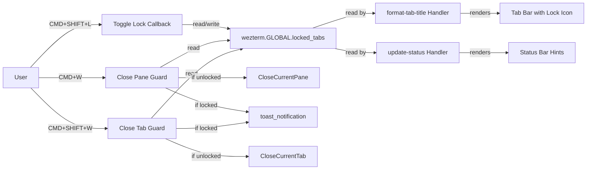
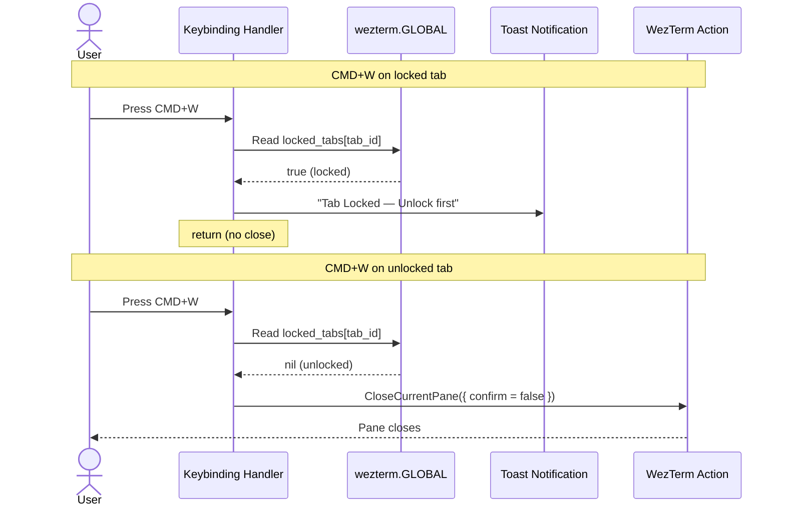
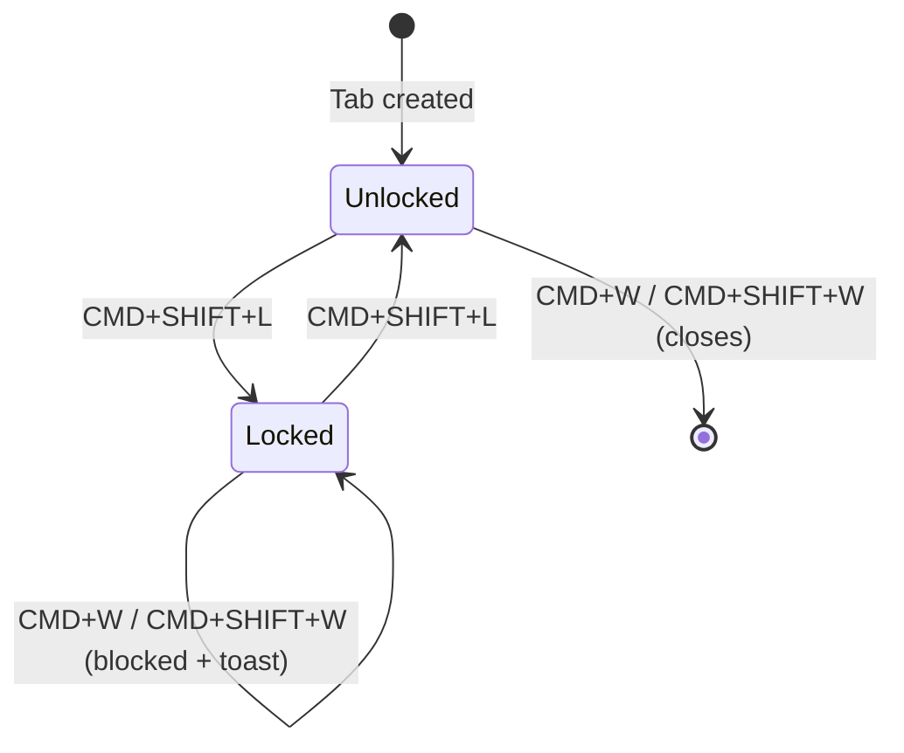

# Solution Design Document

## Validation Checklist

### CRITICAL GATES (Must Pass)

- [x] All required sections are complete
- [x] No [NEEDS CLARIFICATION] markers remain
- [x] Architecture pattern is clearly stated with rationale
- [x] **All architecture decisions confirmed by user**
- [x] Every interface has specification

### QUALITY CHECKS (Should Pass)

- [x] All context sources are listed with relevance ratings
- [x] Project commands are discovered from actual project files
- [x] Constraints → Strategy → Design → Implementation path is logical
- [x] Every component in diagram has directory mapping
- [x] Error handling covers all error types
- [x] Quality requirements are specific and measurable
- [x] Component names consistent across diagrams
- [x] A developer could implement from this design
- [x] Implementation examples use actual schema column names (not pseudocode), verified against migration files
- [x] Complex queries include traced walkthroughs with example data showing how the logic evaluates

---

## Constraints

CON-1: All changes must live in a single file: `~/.config/wezterm/wezterm.lua` (420 lines currently). No external modules, no shell scripts.

CON-2: Must work with WezTerm stable release APIs: `wezterm.GLOBAL`, `wezterm.action_callback`, `window:toast_notification`, `format-tab-title` event. No nightly-only features.

CON-3: Must not conflict with existing keybindings. CMD+SHIFT+L is confirmed free. Must preserve existing tab bar styling (Catppuccin Mocha dark / Latte light).

CON-4: Must not break the existing `update-status` event handler (copy-on-select + shortcut hints).

## Implementation Context

### Required Context Sources

#### Code Context
```yaml
- file: ~/.config/wezterm/wezterm.lua
  relevance: CRITICAL
  why: "Single config file where all changes will be made. Contains keybindings (lines 167-372), event handlers (lines 379-408), theme system (lines 14-116)."

- file: ~/.config/wezterm/theme-mode
  relevance: LOW
  why: "Theme state file. Not modified, but the read_theme_mode() pattern is a reference for file-based state (we chose GLOBAL instead)."
```

#### External APIs
```yaml
- service: WezTerm Lua API
  doc: https://wezfurlong.org/wezterm/config/lua/
  relevance: CRITICAL
  why: "All implementation depends on WezTerm's Lua API: wezterm.GLOBAL, action_callback, format-tab-title, toast_notification, perform_action"
```

### Implementation Boundaries

- **Must Preserve**: All existing keybindings and their behavior for unlocked tabs. Existing tab bar appearance for unlocked tabs. Existing `update-status` handler behavior.
- **Can Modify**: `CMD+W` keybinding action (wrap in callback). `CMD+SHIFT+W` keybinding action (wrap in callback). `update-status` handler (add lock hint). Add new `format-tab-title` handler.
- **Must Not Touch**: Theme definitions, font config, window settings, smart-splits integration, clipboard paste, daily notes, unchecked ideas.

### External Interfaces

No external interfaces. This is a self-contained WezTerm Lua configuration feature with no shell integration, no file I/O, and no network calls.

### Project Commands

```bash
# WezTerm config has no build/test/lint tooling
# Verification is manual:
Reload: CMD+CTRL+, (or restart WezTerm)
Verify: Visual inspection of tab bar + test close behavior
# Note: WezTerm Lua cannot be syntax-checked outside WezTerm (needs its own runtime)
```

## Solution Strategy

- **Architecture Pattern**: Event-driven callbacks within a single Lua configuration file. State stored in `wezterm.GLOBAL` (WezTerm's in-memory global table that survives config reloads). Keybinding actions replaced with `action_callback` wrappers that check state before performing actions.

- **Integration Approach**: Modify two existing keybindings (CMD+W, CMD+SHIFT+W) by wrapping their actions in conditional callbacks. Add one new keybinding (CMD+SHIFT+L). Add one new event handler (`format-tab-title`). Extend one existing event handler (`update-status` for hints).

- **Justification**: `wezterm.GLOBAL` is the simplest approach — no file I/O, no shell integration, no external dependencies. State naturally resets when WezTerm exits (tabs are gone anyway). Config reloads preserve state. The `action_callback` pattern is already used in the config for theme toggle (line 353) and tab rename (line 304), so this follows established patterns.

- **Key Decisions**: See Architecture Decisions section below.

## Building Block View

### Components



### Directory Map

**Component**: wezterm-config (single file)
```
~/.config/wezterm/
├── wezterm.lua          # MODIFY: Add tab lock logic (all 5 components above)
└── theme-mode           # NO CHANGE
```

Changes within `wezterm.lua` organized by section:

```
wezterm.lua
├── Line ~15:   THEME MODE (no change)
├── Line ~118:  FONTS (no change)
├── Line ~122:  APPEARANCE (no change)
├── Line ~166:  KEYBINDINGS
│   ├── Line ~214: CMD+W     # MODIFY: Wrap in action_callback with lock check
│   ├── Line ~221: CMD+SHIFT+W # MODIFY: Wrap in action_callback with lock check
│   └── NEW:       CMD+SHIFT+L # NEW: Toggle tab lock keybinding
├── Line ~374:  COPY ON SELECT / STATUS HINTS
│   └── Line ~387: hints table # MODIFY: Add lock toggle hint entry
├── NEW:        FORMAT-TAB-TITLE event handler # NEW: Prepend lock icon
└── Line ~410:  SMART SPLITS (no change)
```

### Interface Specifications

#### Data Storage Changes

No database. In-memory state only:

```yaml
# wezterm.GLOBAL state (persists across config reloads, resets on WezTerm exit)
wezterm.GLOBAL.locked_tabs:
  type: table (Lua)
  keys: tab_id as string (e.g., "0", "1", "5")
  values: true (present = locked, absent = unlocked)
  default: {} (empty table, initialized on first use)
  lifecycle: Created lazily on first lock. Survives config reloads. Lost on WezTerm exit.
```

#### Internal API Changes

No HTTP APIs. Lua function interfaces only:

```yaml
# Helper function: Check if current tab is locked
Function: is_tab_locked(window)
  Input: window (WezTerm window object)
  Output: boolean
  Logic: Read wezterm.GLOBAL.locked_tabs[tostring(window:active_tab():tab_id())]
  Returns: true if tab is locked, false/nil otherwise

# Helper function: Toggle lock on current tab
Function: toggle_tab_lock(window)
  Input: window (WezTerm window object)
  Output: none (side effect: modifies GLOBAL state)
  Logic:
    1. Initialize wezterm.GLOBAL.locked_tabs if nil
    2. Get current tab_id as string
    3. If currently locked, set to nil (unlock)
    4. If currently unlocked, set to true (lock)

# Helper function: Guard a close action
Function: guarded_close(window, pane, close_action)
  Input: window, pane, close_action (the WezTerm action to perform if unlocked)
  Output: none
  Logic:
    1. Check is_tab_locked(window)
    2. If locked: call window:toast_notification with unlock instructions
    3. If unlocked: call window:perform_action(close_action, pane)
```

#### Application Data Models

```pseudocode
# No formal data model. Single global state table:
STATE: wezterm.GLOBAL.locked_tabs
  TYPE: Lua table
  KEYS: string (tab_id converted via tostring())
  VALUES: boolean (true = locked)
  OPERATIONS:
    + is_tab_locked(window): boolean
    + toggle_tab_lock(window): void
    + guarded_close(window, pane, action): void
```

#### Integration Points

No external integrations. All components communicate through `wezterm.GLOBAL` (shared in-memory state).

### Implementation Examples

#### Example: Toggle Lock Callback

**Why this example**: Demonstrates the `wezterm.GLOBAL` read/write pattern and `toast_notification` feedback — the core pattern reused by all three keybindings.

```lua
-- Toggle tab lock (CMD+SHIFT+L)
{
  key = "l",
  mods = "CMD|SHIFT",
  action = wezterm.action_callback(function(window, pane)
    wezterm.GLOBAL.locked_tabs = wezterm.GLOBAL.locked_tabs or {}
    local tab_id = tostring(window:active_tab():tab_id())
    if wezterm.GLOBAL.locked_tabs[tab_id] then
      wezterm.GLOBAL.locked_tabs[tab_id] = nil
      window:toast_notification("Tab Unlocked", "Tab can now be closed normally.", nil, 2000)
    else
      wezterm.GLOBAL.locked_tabs[tab_id] = true
      window:toast_notification("Tab Locked", "Tab protected from CMD+W / CMD+SHIFT+W.", nil, 2000)
    end
  end),
},
```

#### Example: Close Guard Callback

**Why this example**: Shows the conditional close pattern used by both CMD+W and CMD+SHIFT+W. The only difference is the `close_action` passed.

```lua
-- Close pane with lock guard (CMD+W)
{
  key = "w",
  mods = "CMD",
  action = wezterm.action_callback(function(window, pane)
    local locked_tabs = wezterm.GLOBAL.locked_tabs or {}
    local tab_id = tostring(window:active_tab():tab_id())
    if locked_tabs[tab_id] then
      window:toast_notification("Tab Locked", "Unlock first with CMD+SHIFT+L", nil, 3000)
      return
    end
    window:perform_action(act.CloseCurrentPane({ confirm = false }), pane)
  end),
},
```

#### Example: Format Tab Title with Lock Icon

**Why this example**: The `format-tab-title` event handler is the most complex new addition. It must replicate existing tab styling while adding the lock icon, and work with both dark and light themes.

```lua
wezterm.on("format-tab-title", function(tab, tabs, panes, config, hover, max_width)
  local title = tab.tab_title
  if not title or #title == 0 then
    title = tab.active_pane.title
  end

  -- Check lock state
  local locked_tabs = wezterm.GLOBAL.locked_tabs or {}
  local is_locked = locked_tabs[tostring(tab.tab_id)]
  local lock_prefix = is_locked and (wezterm.nerdfonts.fa_lock .. " ") or ""

  -- Truncate title to fit tab width (account for lock icon + padding)
  local available_width = max_width - 2  -- padding
  if is_locked then
    available_width = available_width - 2  -- lock icon + space
  end
  title = wezterm.truncate_right(title, available_width)

  return " " .. lock_prefix .. title .. " "
end)
```

**Note**: This returns a simple string. WezTerm applies the active/inactive tab colors from `config.colors.tab_bar` automatically when the return value is a string (not a `FormatItem` table). This preserves the existing Catppuccin styling without needing to duplicate color definitions.

**Traced walkthrough — string return vs FormatItem table**:
- String return `" 🔒 zsh "` → WezTerm applies `active_tab` or `inactive_tab` colors from config automatically
- FormatItem table `{ {Background={Color=...}}, {Text=...} }` → Full manual color control, must duplicate theme colors
- **Decision**: Use string return for simplicity. Theme colors stay managed in one place.

#### Example: Updated Status Hints

**Why this example**: Shows how to add the lock hint to the existing hints array without disrupting the current layout.

```lua
-- In the update-status handler, add to the hints table:
local hints = {
  { key = "^⌘R", label = "RenameTab" },
  { key = "⇧⌘L", label = "Lock" },        -- NEW
  { key = "⇧⌘N", label = "DailyNote↓" },
  { key = "⇧⌘M", label = "Ideas↓" },
  { key = "⇧⌘T", label = "Theme" },
}
```

## Runtime View

### Primary Flow

#### Flow 1: Lock a Tab (CMD+SHIFT+L)
1. User presses CMD+SHIFT+L on active tab
2. `action_callback` fires, reads `wezterm.GLOBAL.locked_tabs`
3. If tab not in table → adds `tab_id = true`, shows "Tab Locked" toast
4. If tab already in table → removes entry (sets to nil), shows "Tab Unlocked" toast
5. `format-tab-title` re-renders on next tab bar update → lock icon appears/disappears

#### Flow 2: Blocked Close (CMD+W on locked tab)
1. User presses CMD+W
2. `action_callback` fires, checks `wezterm.GLOBAL.locked_tabs[tab_id]`
3. Tab is locked → shows "Tab Locked — Unlock first with CMD+SHIFT+L" toast (3s)
4. Function returns early, no close action performed

#### Flow 3: Normal Close (CMD+W on unlocked tab)
1. User presses CMD+W
2. `action_callback` fires, checks `wezterm.GLOBAL.locked_tabs[tab_id]`
3. Tab is NOT locked → calls `window:perform_action(act.CloseCurrentPane({ confirm = false }), pane)`
4. Pane closes normally (identical to current behavior)



### Error Handling

- **`wezterm.GLOBAL.locked_tabs` is nil**: Handled by `or {}` fallback on every read. No crash possible.
- **Tab ID doesn't exist in table**: Lua table lookup returns `nil`, which is falsy → treated as unlocked. Correct behavior.
- **`toast_notification` fails or is unsupported**: Toast is fire-and-forget. If it fails silently, the close is still blocked (which is the critical behavior). User just won't see the message.
- **Config reload during lock check**: `wezterm.GLOBAL` survives reloads. Lock state preserved.
- **Tab closed by other means** (e.g., process exits): The tab disappears. Its ID remains in `locked_tabs` as a stale entry. This is harmless — stale entries are never referenced because the tab no longer exists. No cleanup needed.

## Deployment View

No change to deployment. This is a local dotfile edit. Changes take effect on WezTerm config reload (CMD+CTRL+,) or WezTerm restart.

## Cross-Cutting Concepts

### Pattern Documentation

```yaml
# Existing patterns reused
- pattern: action_callback with window/pane args
  relevance: CRITICAL
  why: "Already used for theme toggle (line 353), tab rename (line 304), clipboard paste (line 259). Tab lock follows the same pattern."

- pattern: wezterm.GLOBAL for persistent state
  relevance: CRITICAL
  why: "WezTerm's official mechanism for cross-reload state. New to this config but well-documented in WezTerm API."

- pattern: update-status event for hints bar
  relevance: MEDIUM
  why: "Existing handler (line 379) extended with one new hint entry."
```

### User Interface & UX

**Tab Bar Visualization**:

```
UNLOCKED TABS (current behavior):
┌──────────┬──────────┬──────────┐
│  zsh     │  nvim    │  ssh     │
└──────────┴──────────┴──────────┘

AFTER LOCKING "ssh" TAB:
┌──────────┬──────────┬──────────┐
│  zsh     │  nvim    │ 🔒 ssh   │
└──────────┴──────────┴──────────┘

STATUS BAR HINTS (right-aligned):
^⌘R RenameTab │ ⇧⌘L Lock │ ⇧⌘N DailyNote↓ │ ⇧⌘M Ideas↓ │ ⇧⌘T Theme
```

**Tab Lock State Diagram**:



## Architecture Decisions

- [x] ADR-1: State Storage — `wezterm.GLOBAL` in-memory table
  - Rationale: Simplest approach, no file I/O or shell integration. Survives config reloads. State naturally resets on exit (tabs are gone anyway).
  - Trade-offs: No persistence across WezTerm restarts. Acceptable because tab IDs change on restart.
  - User confirmed: Yes (brainstorm phase)

- [x] ADR-2: Close Behavior — Silent block with toast notification
  - Rationale: Non-intrusive feedback. User prefers awareness over confirmation dialogs. No nightly WezTerm dependency.
  - Trade-offs: No override mechanism — must explicitly unlock first. Acceptable for personal use.
  - User confirmed: Yes (brainstorm phase)

- [x] ADR-3: Visual Indicator — Lock icon via Nerd Font glyph in tab title
  - Rationale: Immediately visible which tabs are protected. Uses existing Nerd Font (RobotoMono Nerd Font Mono). Simple string return preserves Catppuccin theme colors automatically.
  - Trade-offs: No color differentiation for locked tabs (icon-only). Acceptable — icon is sufficient.
  - User confirmed: Yes (brainstorm phase)

- [x] ADR-4: Toggle Keybinding — CMD+SHIFT+L
  - Rationale: Follows existing CMD+SHIFT pattern (N=DailyNote, M=Ideas, T=Theme). L for Lock is mnemonic. No conflict with existing bindings.
  - Trade-offs: None identified.
  - User confirmed: Yes (brainstorm phase)

- [x] ADR-5: Tab Title Rendering — String return (not FormatItem table)
  - Rationale: String return lets WezTerm apply `config.colors.tab_bar` colors automatically. Avoids duplicating Catppuccin color values in the format-tab-title handler. Simpler code, theme changes propagate automatically.
  - Trade-offs: Less control over lock icon color (inherits tab foreground color). Acceptable — consistency with tab text is actually desirable.
  - User confirmed: Pre-confirmed (implementation detail, follows simplicity preference)

## Quality Requirements

- **Performance**: Lock check adds one table lookup per CMD+W/CMD+SHIFT+W press. Negligible overhead (<1ms). `format-tab-title` adds one table lookup per tab render. Negligible.
- **Usability**: Single keybinding to toggle. Clear visual indicator. Informative toast on blocked close. Zero friction added to unlocked tabs.
- **Reliability**: No crash paths. All GLOBAL reads use `or {}` fallback. Stale entries are harmless. Config reloads preserve state.

## Acceptance Criteria

**Main Flow Criteria:**
- [x] WHEN user presses CMD+SHIFT+L on an unlocked tab, THE SYSTEM SHALL add the tab to locked state and display a lock icon in the tab title
- [x] WHEN user presses CMD+SHIFT+L on a locked tab, THE SYSTEM SHALL remove the tab from locked state and remove the lock icon
- [x] WHEN user presses CMD+W on a locked tab, THE SYSTEM SHALL block the close and display a toast notification with unlock instructions
- [x] WHEN user presses CMD+SHIFT+W on a locked tab, THE SYSTEM SHALL block the close and display a toast notification with unlock instructions
- [x] WHEN user presses CMD+W on an unlocked tab, THE SYSTEM SHALL close the pane normally
- [x] WHEN user presses CMD+SHIFT+W on an unlocked tab, THE SYSTEM SHALL close the tab normally

**Error Handling Criteria:**
- [x] WHEN wezterm.GLOBAL.locked_tabs is nil, THE SYSTEM SHALL treat all tabs as unlocked (no crash)
- [x] WHEN a locked tab is closed by other means (process exit), THE SYSTEM SHALL leave a harmless stale entry

**Edge Case Criteria:**
- [x] WHILE config is reloading, THE SYSTEM SHALL preserve all lock states via wezterm.GLOBAL
- [x] WHILE a tab has multiple panes, THE SYSTEM SHALL block CMD+W on any pane in a locked tab

## Risks and Technical Debt

### Known Technical Issues

None. This is a new feature on a clean config.

### Technical Debt

- The `format-tab-title` handler will need to be maintained if the tab bar styling is changed. Currently, using string return avoids color coupling, but if custom per-tab colors are ever desired, this handler would need a `FormatItem` table return.

### Implementation Gotchas

- **Lua `tostring()` on tab_id**: Tab IDs are numbers. Lua table keys with number keys and string keys are different (`t[1]` vs `t["1"]`). Always use `tostring(tab_id)` for consistency.
- **`wezterm.GLOBAL` initialization**: Must use `wezterm.GLOBAL.locked_tabs = wezterm.GLOBAL.locked_tabs or {}` pattern. Cannot assign sub-keys on a nil table.
- **`format-tab-title` event**: Returns affect ALL tabs. Must handle both locked and unlocked tabs. If the handler errors, WezTerm falls back to default title rendering (degraded but not broken).
- **Toast notification duration**: 3000ms for blocked close (important feedback), 2000ms for lock/unlock toggle (confirmation feedback). These are suggestions, not critical.
- **WezTerm Lua syntax checking**: Cannot lint outside WezTerm. A syntax error will prevent config reload. Test incrementally.

## Glossary

### Domain Terms

| Term | Definition | Context |
|------|------------|---------|
| Tab Lock | A per-tab flag preventing accidental closure via close keybindings | Core feature concept |
| Locked Tab | A tab with lock state set to true in wezterm.GLOBAL | Visual indicator: lock icon |
| Unlocked Tab | A tab with no entry in locked_tabs (default state) | Normal close behavior |

### Technical Terms

| Term | Definition | Context |
|------|------------|---------|
| wezterm.GLOBAL | WezTerm's built-in global Lua table that persists across config reloads | State storage for locked tab IDs |
| action_callback | WezTerm API for creating inline keybinding actions with Lua functions | Used for lock toggle and close guards |
| format-tab-title | WezTerm event fired when rendering each tab title | Used to prepend lock icon |
| toast_notification | WezTerm API for displaying brief desktop notifications | Used for lock/unlock/blocked feedback |
| tab_id | Numeric identifier assigned by WezTerm to each tab on creation | Used as key in locked_tabs table |
